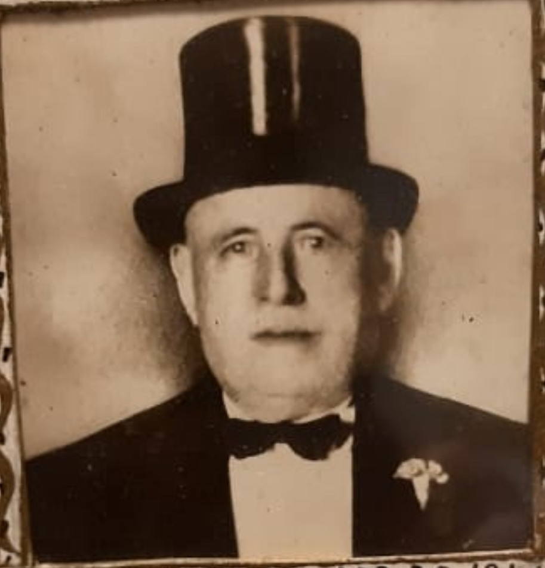
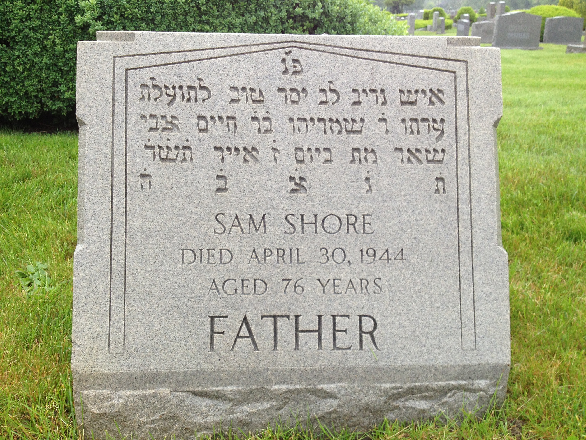
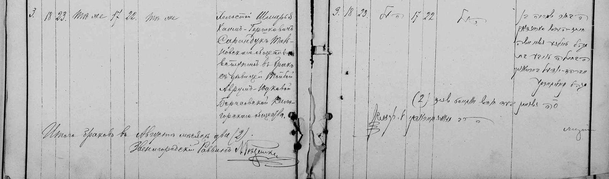
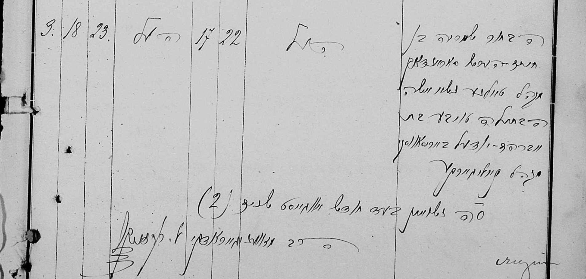
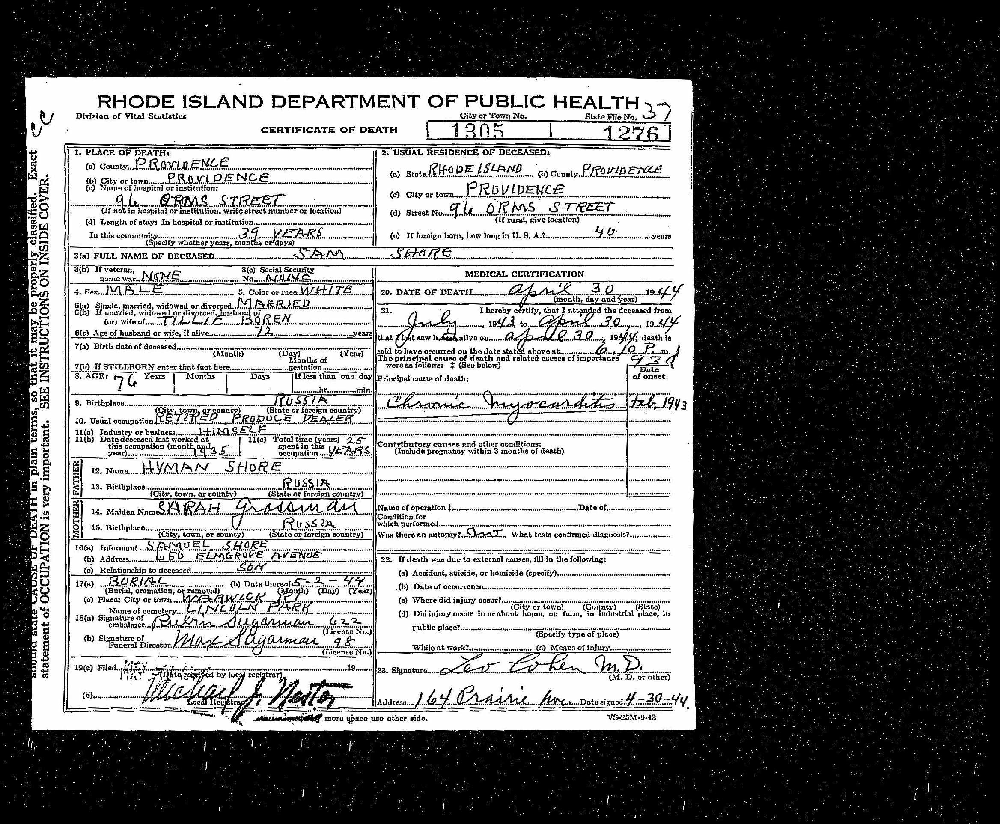

### Quick Facts

| Name     | Value                                          |
| -------- | ---------------------------------------------- |
| Parents  | [Hyman and Sarah Shore](/post/hyman-and-sarah) |
| Birth    | March 10th, 1868                               |
| Spouse   | [Tillie Beresovsky]() _(placeholder link)_     |
| AKA      | Shmarya Saranduk / Shore                       |
| Death    | April 30th, 1944                               |
| Yarhzeit | Iyar 7                                         |
| Burial   | Lincoln Park Cemetery, Warwick, RI.            |

---

### My Summary

Tonight, the 7th of Iyar, marks the 80th anniversary of the passing of my great-great grandfather, Shmariahu (Saranduk) Shore. In America, he went often by Sam Shore. May his _neshama_ have an _aliyah_.

Sam Shore / Shmarya Saranduk was the oldest son of [Hyman and Sarah Shore](/post/hyman-and-sarah) and was apparently a rather intimidating personality. 
He was Sabbath observant and religious, even in America. 
He was the first president of Sons of Jacob Synagogue in Providence, RI. An Orthodox Synagogue, now a protected historical site.
His son's also financed the building. (source: my father). Personally, I remember going to Sons of Jacob as a child and seeing his name displayed prominently in varios places, although I don't remember all the details.
He also had an entrepreneurial spirit. He was a colorful personality and was often cast as protagonist in tall tales about great strength and somewhat unchecked aggression. This tendency is demonstrated in some of the notes below.

He also had some artistic ability. He helped design the fresco at Sons on Jacob Synagogue in Providence, RI and some of his paper cuttings are at the Museum of Fine Arts in Boston and have been sold at various Judica auctions.

I have included notes on Sam Shore below from Ruth Mondlick and Rabbi Shmaria Shore. 
Personally, I am doubtful of many of the stories in these notes, but I think it gives you a sense of the person.
Even though I'm relatively certain he never punched out a horse, they don't say such stories about me!
Overall, the picture I get is one of a religious person who had a love for life, an artistic soul, knew how to get what he wanted, and could be very sweet when he needed to be, but also very intimidating when he needed to be.

Here is an example of a papercut he made commemorating his parents:

Sam Shore was buried in Lincoln Park Memorial Cemetery.

| Source: Ruth Mondlick's Notes                                                                                                                                                                                 |
| ------------------------------------------------------------------------------------------------------------------------------------------------------------------------------------------------------------- |
| **Ruth Mondlicks notes**: This information was e-mailed to Ruth Shore Mondlick on August 22, 2005 by **Barrie Shore**. Barrie is the son of Albert Louis Shore (born 9/08/1908) and grandson of Samuel Shore. |

1. Was charged with "Assault and Battery" by some black tenant. Did not understand why he was "charged" for something he had not bought.
2. Fascination with use of new metal zipper fly, as opposed to older button counterpart. Would boastfully pull up and down his new fly.
3. While he was a patient in the hospital (probably original Miriam Hospital), he walked out and drove to Narragansett for a day of swimming, then returned to hospital after swimming day completed.
4. Hit referee of boxing match after his relative lost in ring.
5. Made friends with Mr. Harrington of New Haven Railroad, who then rented him space under a railroad bridge on South Main Street, Providence for sale of fruits and vegetables-kept family going for years. Supposedly this took place after a fire burned down the building he owned, with no insurance.
6. While being visited by a famous Russian Rabbi in Providence, he was visited by his granddaughter, Marjorie, with her father, Albert. Marjorie, on seeing the Rabbi, identified him as "Santa Clause." Marjorie then explained, on observing the Rabbi's beard, that "..There's water in there."
7. Ignoring the warning of a providence policeman, who Zaida knew as a child, he grabbed his son, presumable Dave, who had called the cop to prevent such behavior by Zaida.
8. Down stairs neighbors and tenants, presumably Turks, afraid of nothing, were terrified of Zaida.
9. Would grab hold of enormous rope, the other end of which were collectively held by all his children, for "tug of War" Zaida won.
10. Hit his horse, which fell down.
11. Loved watermelon and would take the center for himself.
12. His sons employed an old Jewish man, to live with Zaida and Bubba, whose only function was to play gin Rummy any time of the night or day in order to avoid disturbing Bubba.

> **_Jacob's notes_**: My father, Howard Scott Shore, cautions to take what Barrie Shore says with a grain of salt. He claims that he heard a lot of tall-tales from Great Uncle Barrie that his grandfather (Samuel Oscar Shore) dismissed entirely. I copied the Aunt Ruth's notes verbatim without editing, even though I felt some of the language was somewhat offensive to modern sensibilities. I believe Aunt Ruth's notes were the exact text of Barrie's email.

| Source: Rabbi Shmaria Shore's notes             |
| ----------------------------------------------- |
| Italics are annotations by Rabbi Shmaria Shore. |

Shmari Shore—ruled the house like a king in his castle. They were afraid of him. He began by selling shmattes. Afterwards sold onions and potatoes and moved on to fruit, all this under the bridge on N. Main Street Providence. He sold peanuts in bags.

Shmari and Asher were very similar. His mother-in-law died on the boat trip to the United States because the food was not kosher and she refused to eat. Her body was thrown aboard and by miracle arrived at Haifa and was identified there, and she was buried in Israel.

_In another part of Shmarya’s notes it says that they received a note that they got the body and it was sent to Israel._

Shmari's house was religious and he put on tefillin. He gave a religious education to his children. The bar mitzvah of Shmari took place when they were selling shmattes—they just went in to the synagogue, finished and went back.

> **_Jacob note_** - Shmari’s bar mitzva was in Talne presumably. My father confirms that he's heard this story about his grandfather, Asher Shore (Shmarya's son).

Shmari began a "Hebrew Free Sheltering" center in Providence. People could sleep there for free and it still exists today. (25 S. Court Street)

In Shmari's home they observed Shabbat. Asher studied until 8th grade in school.

Shmari bought a grocery store from William Fishbein and remodeled it.

He _Shmari_ was a good actor. He would help children in distress.
His wife was quiet, he was completely dominant.

Shmari taught Tzivia to smoke (he rolled his own).

> **_Jacob Note_** - Who was Tzivia? Perhaps his wife Taube.

Chess: if he saw that he was about to lose, he would give a whack on the table….. or take some pieces out from his shirt! _good idea._

Sometimes in the middle of the night he wanted to play cards, and so he would wake up his wife and she had no choice… the boys saw that this was not a good situation, so they paid someone who's job was to sleep there, dressed, and any time that Shmari wished he would be ready to play with him at a moment's notice. He was hired for "disturbed sleep". Shmari would wake up and cry out "Cards!"

When he was hospitalized, he sneaked out of the hospital to see dog races. He would go with Tova to nightclubs, wrestling matches.

> **_Jacob Note_** - probably should be Taube

Once he was angry at his horse, gave it a punch and it died on the spot.

He would pick up a horse to show his strength.

He was capable of breaking chairs and tables with one foot.

_There are even weirder stories and their plausibility seems doubtful to me… especially having inherited his name. but if any of you see me doing questionable stuff, I have an excuse to say where it comes from._

Their 50th wedding anniversary was at the Hillsgrove Country Club.

He was not a good driver and was involved in accidents.

He greeted everything _everyone_ with joy and laughter.

In the store he would kiss his sons.

_Weird story about the Tolna Rebbe who came to visit Shmari, something about him explaining to him what Santa Claus is._

#### My Notes:

Seems a lot of Shmarya's notes are based on the testimonies of Barrie Shore My father cautions us to take Barrie's testimonies with a grain a salt. He was known to tell tall tales at times.

My father grew up around his grandfather, Samuel Oscar Shore, regarding his great grandfather, Sam Shore, he told me: “I heard a lot of nonsense stories (about Sam Shore) that my grandfather (Samuel Oscar Shore) dismissed.”

Record of _Shmarya_ and _Taube_’s wedding in Talne from the community ledger in (Cherkassy):

## Children

---

- [Bessie Fishbein]() _(placeholder)_
- [David Louis Shore]() _(placeholder)_
- [William Shore]() _(placeholder)_
- [Joseph Shore]() _(placeholder)_
- [Samuel Oscar Shore]() _(placeholder)_
- [Jacob Shore]() _(placeholder)_
- [Albert Louis Shore]() _(placeholder)_

This is the death certificate for Sam Shore:

The death certificate contains various inaccuracies. For example, there is a fair amount of proof that his mother's maiden name was not Grossman.
