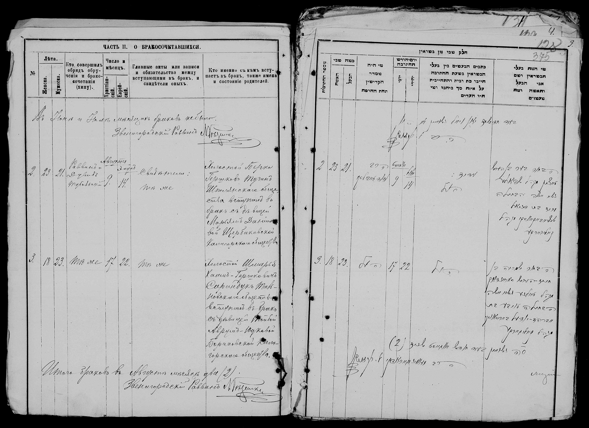

### Quick Facts

| Key        | Value                                              |
| --------   | ----------------------------------------------     |
| Parents    | Avraham Edel Beresovsky, Rachel Bockman           |
| Birth      | August 1st, 1871                                   |
| Birthplace | Kalniboloto (Katerynopil)                          |
| Spouse     | [Sam Shore](/post/the-80th-yahrtzeit-of-sam-shore) |
| AKA        | Taube Saranduk / Shore                             |
| Death      | January 19, 1954                                   |
| Yarhzeit   | Shvat 15 (Tu b'Shvat 5714)                        |
| Burial     | Lincoln Park Cemetery, Warwick, RI.                |

---

```goat
        Avraham Edel Beresowsky ---+--- Rachel Bockman    Chaim Svi Saranduk ----+---- Sara Mamorofsky
                                   |                                             |
                            Taube / Tillie --+------------------------------- Shmaria / Sam
                                             |
                                      Samuel Oscar Shore --+----+----+- Teresa Slutsky    
                                                          /     |     \ 
                                                         Al    Harold  Ruth
```

This coming Thursday is the Jewish Holiday of Tu b'Shvat - the new year for fruit. The main significance of this Holiday is related to tithing, but there are various Jewish customs also connected with it. Besides it's significance in tithing, the 15th of Shvat is also significant as it is the Yahrzeit (anniversary of the passing) of Taube Shore.

### Taube's Home Town

My father's cousin, Shmaria (Tillie's husband's namesake), has shared some note he took while researching the family history.

In his notes, Shmaria says that Tillie / Taube and her brother, David, "came from a small town near [Tolna](https://www.jewishgen.org/ukraine/GEO_Town.asp?id=156) called Kaliblotot". Originally I have had assumed that the name of the town referenced was [Kal'nybolota, Kirovohrad Oblast, Ukraine](https://www.jewishgen.org/ukraine/GEO_town.asp?id=24). This town is about an hour drive from Talne. Seems like an open and shut case. However, like all things Ukrainian Geography, **nothing** is **ever** straightforward. There is another town, about half an hour drive from Talne call [Yekaterinopol](https://www.jewishgen.org/ukraine/GEO_Town.asp?id=101) which used to be called Kalniboloto by the Russians. Supposedly, based on the forums in JewishGen, it was still called that amongst Jews at the time. 

As mentioned earlier, a few years ago, I discovered a record of Shmaria and Taube's marriage in the Cherkassy Records. [Mokra Kaligorka](https://www.jewishgen.org/ukraine/GEO_Town.asp?id=121) is the town listed as the town of the bride. At [jewua.org](https://jewua.org/mokra-kaligorka/) it claims that "Mokra Kaligorka is town of the Katerinopol district, Cherkassy region." 

### Accounts of Taube

#### Taube's Parents

Shmaria's notes reference mention that Taube's parents were divorced. He says that here father Avrum Edel owned / ran a tavern, and "died from a shot of whiskey". He also references a family legend that Tillie's mother died on the boat on the way to America because she wouldn’t eat non kosher food. According to the legend, she was then thrown off the boat with a note stating that the body was that of a Jewish woman and a request to whoever finds her to bury her in Israel. The story goes on to claim that they later "received a note" confirming the body was found and sent to Israel for burial. I have heard this story in various forms before from my father and Auth Ruth.

