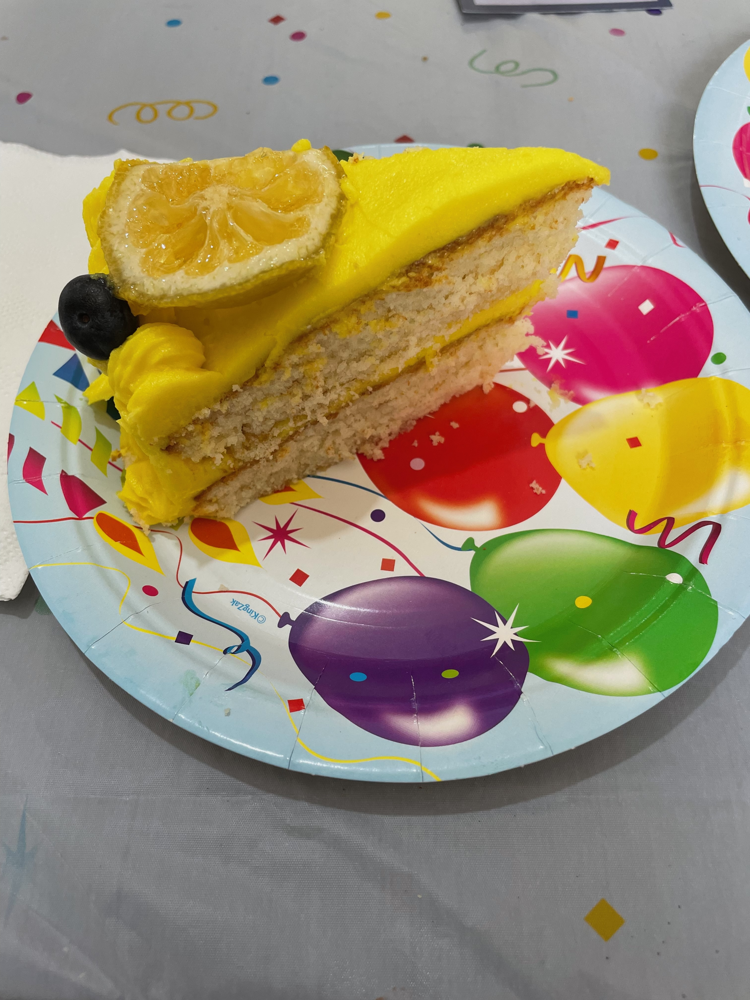

## تأمُّل:

اليوم ما نحبش نحكي في الحرب.

الجمعة عندنا شهر جديد - اسمو تاموز - الشهر متاع عيد ميلادي! عيد ميلادي هو الخمسة في شهر تاموز - اليوم النبي حزقيال شاف رؤى مركبة ربي حذا الواد خابور ( سوريا ماتع توا).

>  فِي السَّنَةِ الثَّلَاثِينَ مِنْ عُمْرِي، فِي اليَوْمِ الخَامِسِ مِنَ الشَّهْرِ الرَّابِعِ، كُنْتُ بَيْنَ المَسبِيِّينَ قُرْبَ نَهْرِ خَابُورَ. فَانفَتَحَتِ السَّمَاءُ وَرَأيْتُ رُؤَىً وَمَنَاظِرَ إلَهِيَّةً. \
> --  ﺣﺰﻗﻴﺎﻝ 1:1

ما نعرفش معنى الحقيقة هاذي

كل عام, مرتي الغالية تعمل كيكة من نوع اخر. العام لي فات عمات كيكة ليمون.

## ڤيديو:


