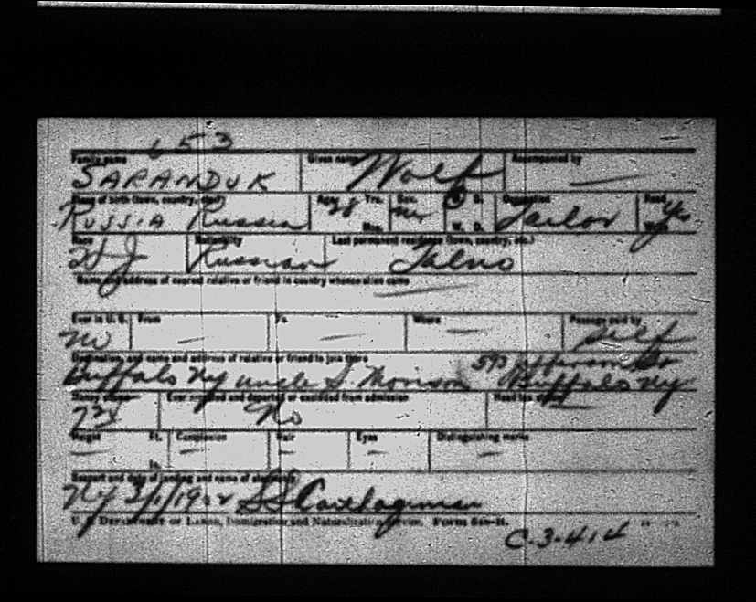
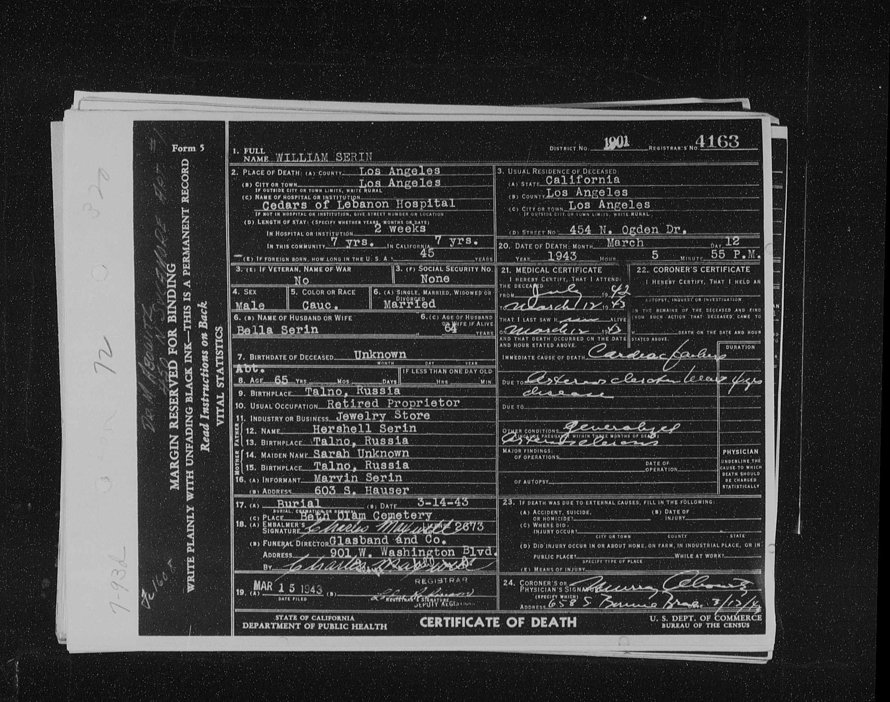
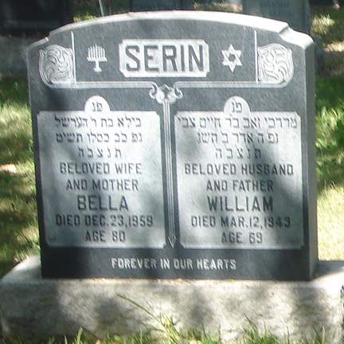
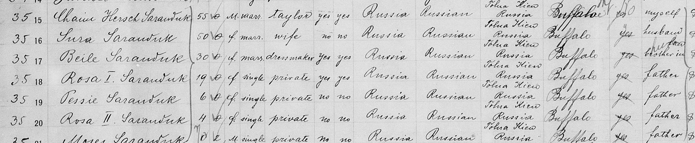

Born Velvel/Wolf Saranduk in 1874 in the Town of Talne, to [Hyman Shore and Sarah Shore](/post/hyman-and-sarah).
His Hebrew name was Mordechai Zev. Married [[Bella Sarles]] in Talne. He died in California on March 12th, 1943 at age 69.

Found on the Ukraine Revision Lists, Group 2, yr 1897 under surname "Saranduk" in the own of Talne:

| Given Name    | Father       | Relationship to Head of Househoud | Sex | Age |
| ------------- | ------------ | --------------------------------- | --- | --- |
| Motez Volko   | Khaym Ghersh | Head of Household                 | M   | 26  |
| Beyla         | Gershko      | Wife of Motez Volko               | F   | 23  |
| Peysya Brucha | Motez Volko  | Daughter                          | F   | 1   |

[Original Ukrainian Census Document](https://data.jewishgen.org/imagedata/ukraine/Uman_district/384-12-301/104.jpg)

Here is a photograph of the Migration record from 1902 where Wolf Saranduk claims he is moving to Buffalo, NY to join an uncle (S. Morison?)

It lists his profession as a tailor. That is the profession listed for all Saranduk men (as far as I know).

On his death certificate it says he had a Jewelry Shop in California. I don’t know much about how he wound up so far away from the rest of the Saranduk family, or why he changed his name to Serin (sometimes Serrin) instead of Shore (although it does seem somewhat closer to the original).

### Children

- **Pessia Brucha Saranduk**, born 1896/7 in Tal'ne, is found in the Ukrainian Revision Lists. A Pessie Saranduk found on the ship logs at Ellis Island for the U.S.S Gerty. She eventually married _Maurice Berren_ and died in Rhode Island Hospital in December 28th, 1925 (at the age of 29) of Tuberculosis. The name on her tombstone is Bertha Serin Berren.
- **Rosa Saranduk**, born 1900 in Tal'ne, is also found on the U.S.S Gerty ship logs, as Rosa II. She married Abraham Levin.
- **Moische (Marvin) Saranduk**, born in 1904 in Tal'ne, is also found on the U.S.S Gerty ship logs Moses. Later married **Catherine Rabinowitz**. According to a 1950 Los Angeles survey, Marvin Serin was employed as an auctioneer. Catherine as a bookkeeper.
- **Jacob Serin**, born in 1907 in America (Buffalo, NY).
- **Edgar Serin**, born 1912 in America. Wife's name was Dorothy.
- **Irving Serin**, born 1916 in America. Married _Betty May Gilmor_.
