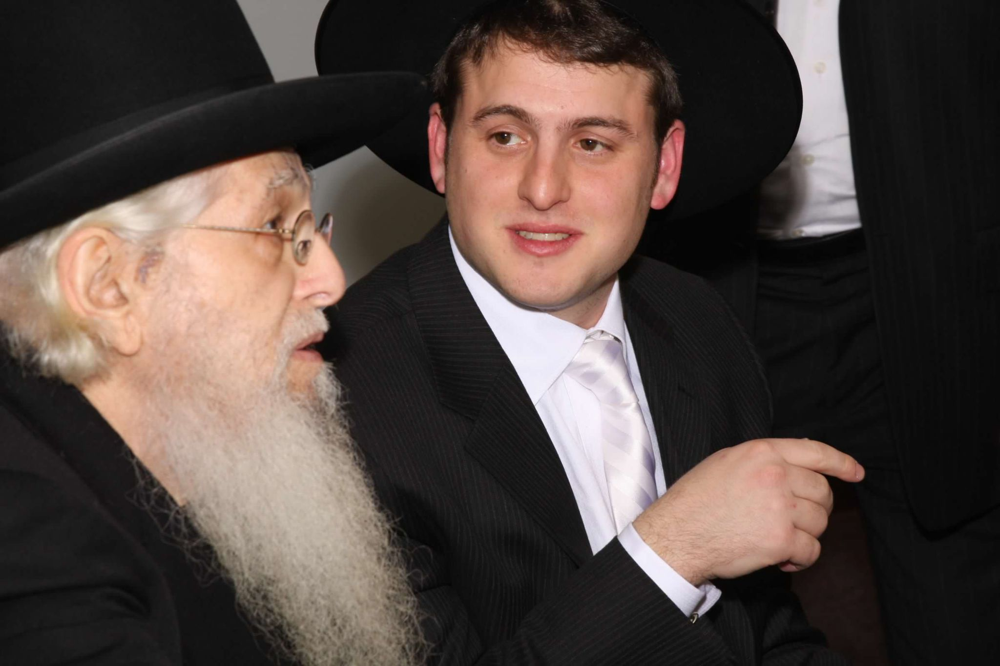

> The Gemara relates that Rabbi Elazar, another of Rabbi Yoḥanan’s students, fell ill. Rabbi Yoḥanan entered to visit him, and saw that he was lying in a dark room. Rabbi Yoḥanan exposed his arm, and light radiated from his flesh, filling the house. He saw that Rabbi Elazar was crying, and said to him: Why are you crying? Thinking that his crying was over the suffering that he endured throughout his life, Rabbi Yoḥanan attempted to comfort him: If you are weeping because you did not study as much Torah as you would have liked, we learned: One who brings a substantial sacrifice and one who brings a meager sacrifice have equal merit, as long as he directs his heart toward Heaven. If you are weeping because you lack sustenance and are unable to earn a livelihood, as Rabbi Elazar was, indeed, quite poor, not every person merits to eat off of two tables, one of wealth and one of Torah, so you need not bemoan the fact that you are not wealthy. If you are crying over children who have died, this is the bone of my tenth son, and suffering of that kind afflicts great people, and they are afflictions of love. Rabbi Elazar said to Rabbi Yoḥanan: I am not crying over my misfortune, but rather, over this beauty of yours that will decompose in the earth, as Rabbi Yoḥanan’s beauty caused him to consider human mortality. Rabbi Yoḥanan said to him: Over this, it is certainly appropriate to weep. Both cried over the fleeting nature of beauty in the world and death that eventually overcomes all.

[From Talmud Bavli, Berahos 5b - Translation from Sefaria](https://www.sefaria.org.il/Berakhot.5b.14?lang=bi&with=all&lang2=en)

The [death of my Rosh Yeshiva](https://hamodia.com/2023/08/24/bde-harav-aharon-schechter-ztl-rosh-yeshivah-yeshivas-chaim-berlin/), Rabbi Aaron Schechter זצ״ל came as a shock yesterday. He hadn't been well for many years, and it was very hard to get in to see him. His memory was not what it used to be towards the end - I guess I had a lot of excuses for not staying in touch. The news of his passing hit me like a ton of bricks. It had been 8 years since I had last spoken with him.

When I left the Yeshiva to study in Kollel Avodas HaLeviim (Ner Israel) in Baltimore, the Rosh Yeshiva told me "Yankel, you're not leaving Chaim Berlin, you're bringing Chaim Berlin to Baltimore!" At this time of great loss, I try to to console myself by telling myself that I didn't leave the Rosh Yeshiva, I bring him with me every day. I'm not going to be so pretentious as to claim to be a _talmid_ of the Rosh Yeshiva זצ״ל, his _talmidim_ are great scholars and leaders of כלל ישראל. But when I was learning in Yeshiva Chaim Berlin, his presence demanded greatness from us! In consoling myself, I want to relate some personal stories I had with the Rosh Yeshiva זצ״לֹ that I take with me every day. This is the first of what will be a series of such stories.

## The Back Story

When I came to Chaim Berlin, at age 22, I wasn't your typical Chaim Berliner. Now, anyone who knows anything about Chaim Berlin will be rolling their eyes at this statement because to be a "typical" Chaim Berliner, you need to have gone to Chaim Berlin in preschool! So I guess what I mean to say is that I wasn't a typical Yeshiva bochur at all. My Yeshiva high school education ended with my being kicked out of Mesivta of Boston in December of my 12th-grade year. From then on I wandered around, enrolling and dropping out of various Yeshivas and Universities. Eventually, I found work as a video editor. At this point, I considered myself to be "an agnostic" and found myself drifting away from religious observance altogether. A dangerous situation involving a car prompted me to make a commitment to return to Yeshiva and give G-d "another try" if I survived. When I did survive, I immediately regretted making such a commitment. Even so, I had made a deal, and I had to hold up my end of the bargain.

When I first contacted Rabbi Eliezer Fireman, my 10th-grade rebbe, I asked him how I could get into Lakewood. When he heard the nature of the deal I had made, he told me that he didn't think Lakewood was a good fit for me. He thought I would find it "stifling" and that Yeshivas Chaim Berlin would be a better fit. And so it was, that I called the Yeshiva to inquire about admissions, dusted off an old גמרא and prepared something to be tested on.

## My First Encounter With The Rosh Yeshiva

In most cases, you can't get accepted to a Yeshiva, without meeting with, and getting approved by, the Rosh Yeshiva. I was the exception. The day I came to be tested the Rosh Yeshiva was moving and he couldn't make it there to test me. As such, I was interviewed by his son, the Mashgiach of the yeshiva, Rabbi Mordechai Schechter.

On the first day of Yeshiva, I got up early, made myself tea, and started heading down towards the בית מדרש for שחרית. When I got to the lobby of the Yeshiva, I encountered the Rosh Yeshiva. The Rosh Yeshiva approached me.

"Good morning, who are you?"

"I'm Yaakov Shore, I'm a new student in the yeshiva", I replied.

"Yaakov, where did you find that tea?", the Rosh Yeshiva inquired.

The Rosh Yeshiva pointed to the tea in my hand. I found this question to be odd, but it was way earlier than I was used to being awake at that time and I couldn't be bothered to try to figure out what he was getting at.

"Downstairs", I said.

"Then drink it downstairs", the Rosh Yeshiva said with a smile.

The Rosh Yeshiva was not keen on people standing around in the Yeshiva lobby, drinking coffee.

## The Shabbos Table

Chaim Berlin is a relatively big yeshiva. But because it is an "in-town" yeshiva, it doesn't offer meals on Shabbos. An "in-town" yeshiva used to mean a yeshiva in New York, although I'm told now it increasingly means a yeshiva in Lakewood. Either way, I was from New England, which placed me squarely "out of town". As such, I had to go to people's houses for Shabbos meals.

I soon found out that there were 8 spots for students to eat at the Rosh Yeshiva's house for Shabbos meals every week. I thought that would be interesting. In day-to-day yeshiva life, you don't have much direct contact with the Rosh Yeshiva. I also assumed there would be a long waiting list, so I went to the person in charge of arranging the guests and quickly asked to be put on the list. When he asked me which meal, day or night, I wanted, I told him it didn't matter, whichever was available first. He then clarified with me that was asking which meal I wanted to go to **that Shabbos**. Can I go to both?

At first, I thought perhaps it was a fluke that there were spots available for that Shabbos. What I later discovered was that the Rosh Yeshiva's Shabbos table was not a typical Shabbos table experience. It would seem that most students preferred the normal Shabbos table experience. For one thing, the Rosh Yeshiva's wife, who had advanced-stage Alzheimer's disease, would be seated at her usual spot at the Shabbos table, this made some students uncomfortable. But I think the main reason bochurim didn't like going to the Rosh Yeshiva's for meals was because there was **absolutely no "shmoozing"** at the Rosh Yeshiva's table. For example, from what I can remember, the Friday night meal always went like this:

- Kiddish would be made. It would be followed by the Hamotzi. So far this is a normal Shabbos meal.
- One of the Rosh Yeshiva's granddaughters would serve gefilte fish. So far still normal.
- When the Rosh Yeshiva put down his fork, Rosh Yeshiva's granddaughter would clear the fish plates.
- The Rosh Yeshiva's grandson in charge of the meals would bring out and distribute חומשים.
- The Rosh Yeshiva would start learning that week's Torah portion, with Rashi and Ramban, out loud. No talking, other than questions related to the material the Rosh Yeshiva was learning then, was allowed.
- At some point the Rosh Yeshiva would close his חומש and his granddaughter would bring out the chicken soup.
- When the Rosh Yeshiva put down his spoon, Rosh Yeshiva's granddaughter would clear the soup bowl.
- The Rosh Yeshiva's grandson would bring out and distribute חומשים.
- The Rosh Yeshiva would continue from exactly where he had left off in that week's Torah portion.
- At some point the Rosh Yeshiva would close his חומש and his granddaughter would bring out the main course.
- When the Rosh Yeshiva put down his fork, Rosh Yeshiva's granddaughter would clear the plates.
- The Rosh Yeshiva's grandson would bring out and distribute חומשים.
- The Rosh Yeshiva would continue from exactly where he had left off in that week's Torah portion.
- At some point the Rosh Yeshiva would close his חומש and his granddaughter would bring out the dessert.
- I believe that dessert was followed immediately by _bentching_ and there was no study session after that, but I'm not certain about this last point.

There's a joke they say about these long sessions of study at the Shabbos table when all talking was forbidden. They say that when a Chaim Berliner gets married, at this first Shabbos meal in his new home, with his new wife, he motions to her and whispers "Honey, could you please pass the salt?"

I immediately saw the opportunity here to learn חומש from the Rosh Yeshiva. But sitting quietly all those hours definitely wouldn't do. So I came up with a plan. Every Friday, I would study that week's Torah portion thoroughly with every Rashi and Ramban. If I'm being honest, I usually only did the first half of the Parsha, or whatever I thought we'd get up to. I'd plan out a bunch of, what I thought to be, clever and open-ended questions on the material. Since everyone else there was generally silent most of the time, I figured it would be like having a private study session with the Rosh Yeshiva!

While I quickly found out that I would have to up the ante regarding my prep work by a large margin, if I wanted to ask questions that the Rosh Yeshiva deemed worthy of responding to in more than just one sentence or less, the general plan worked great! The meals, of course, got a lot longer than they used to be, and not everyone appreciated that, but I paid them no mind. I told myself that if they wanted to, nothing was stopping them from participating, except maybe their lack of familiarity with the source material.

Looking back on this, I realize that was one of the ways the Rosh Yeshiva pushed us to grow. The Rosh Yeshiva knew full well what I was doing, but he knew that this was the driving force to me learning Chumash, Rashi, and Ramban every week. And learning them _well!_ I mean, who learns Chumash _well!?_

One time, the Rosh Yeshiva smiled at me in the middle of a meal, put his hand on my hand, and said, "Yankel, I see you prepared שניים מקרא well this week."

Now that I think about it, today is Friday. Perhaps, I'll go prepare this week's סדרה for the Rosh Yeshiva this Shabbos.

