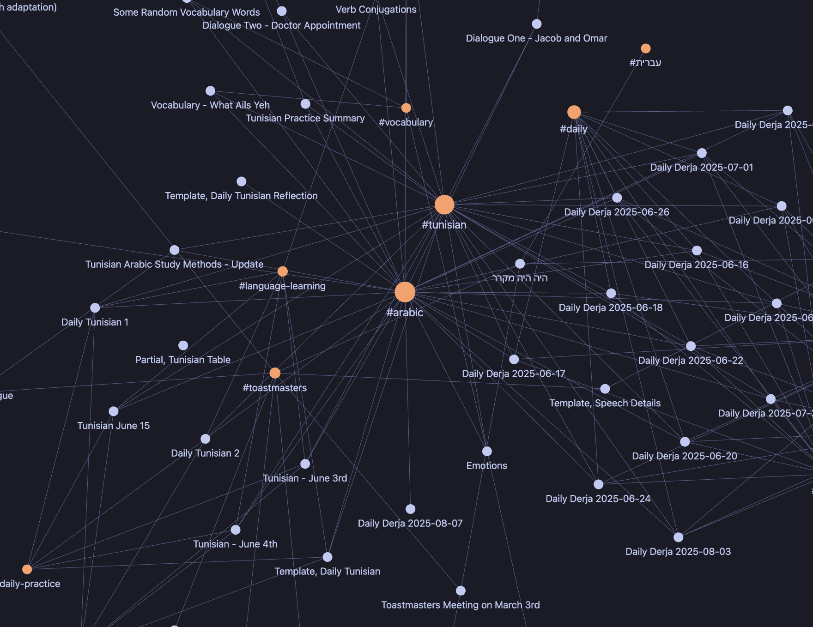
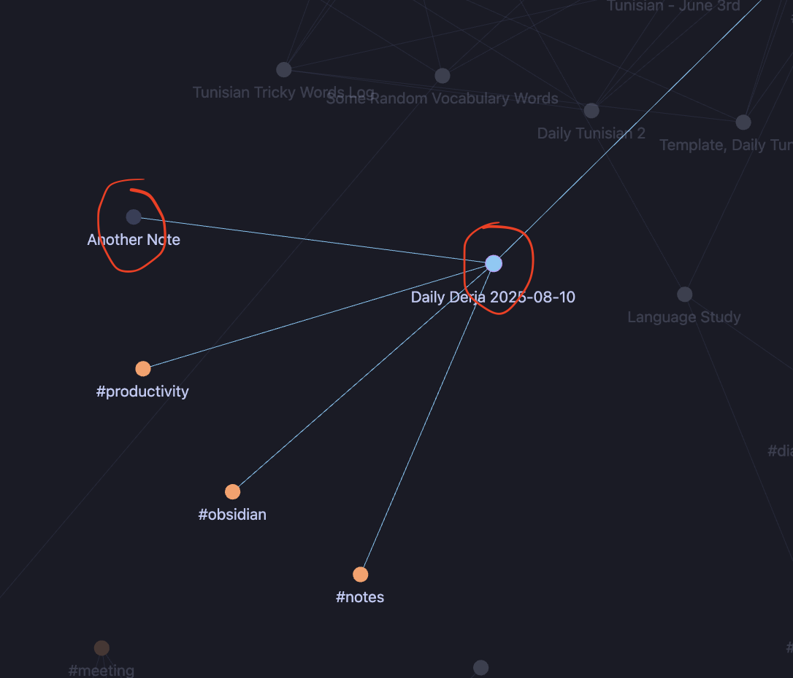
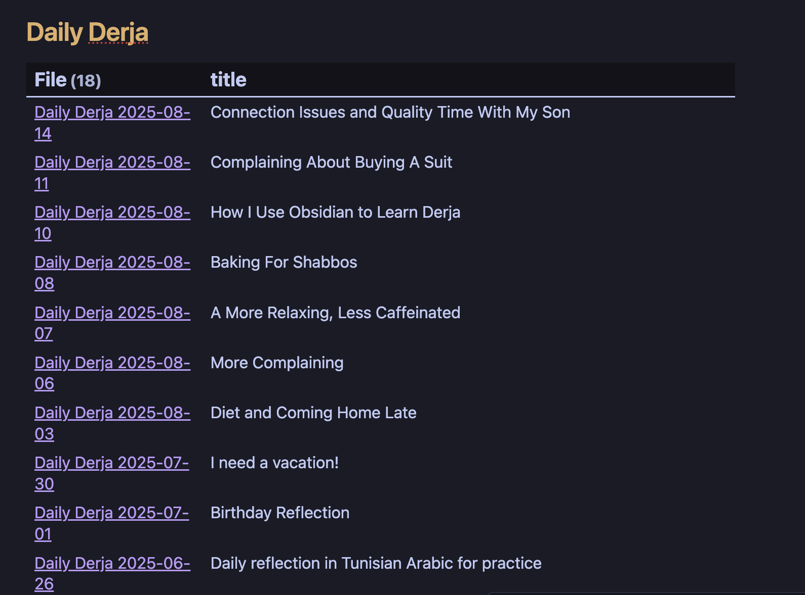
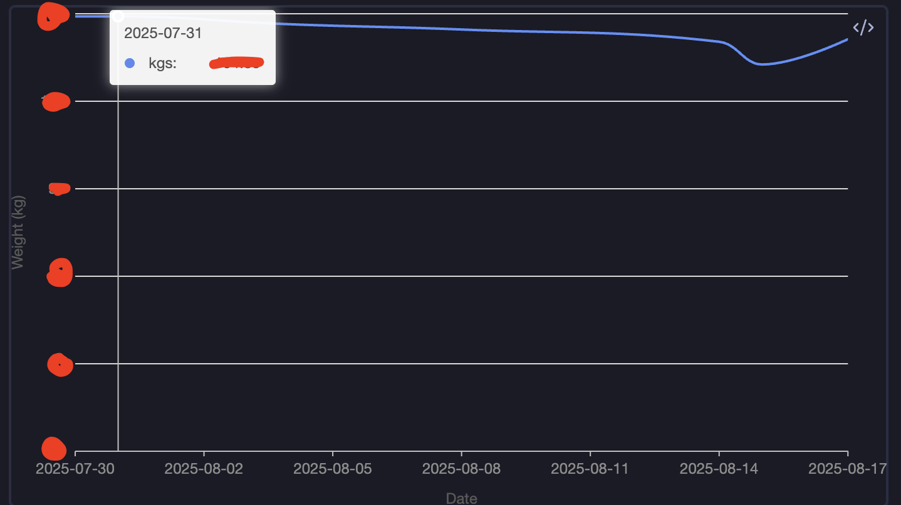

### Obsidian - The Secret Sauce
Obsidian is a [Markdown-based](https://www.markdownguide.org/) note-taking application with a rich plugin ecosystem. This is one of my go-to tools for recording my thoughts and keeping track of things in my life. It also supports hyperlinking notes, so your notes are connected. Connected notes help you avoid "anti-patterns" like stuffing too much into a single note—so long you’ll never read it. You can also view your notes in "graph mode" to see the connections between them visually.         
 


You can also make placeholders for notes you intend to write by adding double brackets [[like this]] around the future note’s title. This immediately creates a link, even if the note doesn’t exist yet. Later, when you actually write the note, the link is already in place.

For example, in the graph below you can see that my daily journal entry [[Daily Derja 2025-08-10]] is linked to another placeholder note called [[Another Note]]. I haven’t written “Another Note” yet, but because I bracketed it, Obsidian already shows the connection in graph view:



This is especially useful when brainstorming—you can sketch out connections before the notes exist, and then gradually fill them in later. Think of it as a way of building the skeleton of your knowledge base before fleshing it out.

### Syncing Vaults 

In Obsidian, your notes are stored in a “vault.” You can have multiple vaults or keep everything in one. Hyperlinks only work between notes in the same vault. 

Obsidian has a desktop app and a mobile app for macOS, Windows, Linux, iOS, and Android. The vaults are designed to sync across devices, but the notes themselves are local files—you own them, and they’re always available as Markdown files. For me, this is a big part of the appeal. All your notes and data are yours, without depending on an app or subscription service to access them.

**There are** various ways to sync vaults. Obsidian offers its own paid service (reasonably priced). You can also use iCloud, OneDrive, Google Drive, and there’s even a Git plugin (*though I’ve only tried iCloud, and I’m not sure if the Git option works well with mobile*).
### Plugins of Note

Another advantage of Obsidian is the plugin ecosystem. It makes note-taking much more productive. There are two types of plugins: core and community. Core plugins are official; community plugins are made by independent developers.

Here are some I use a lot:
#### Audio Recorder (core)

Simple


One of my current hobbies is learning Arabic. Pronunciation is a challenge, and it’s best to have recordings of new words. Obsidian comes with a plugin called Audio Recorder that makes this simple.
#### Templater

Somewhat Advanced



Obsidian already includes a basic templating plugin, but for more advanced functionality it’s worth using [Templater](https://github.com/SilentVoid13/Templater). It has a steeper learning curve, but I use it to generate blog posts and other boilerplate.


#### Quick Add


Somewhat Advanced


There are notes I try to make nearly every day, such as [The Daily Derja](https://dailyderja.com)—a Tunisian Arabic journal to improve my language skills—or logs like my weight. To stay consistent, creating these notes needs to be frictionless. [QuickAdd](https://github.com/chhoumann/quickadd) removes a lot of that friction.


#### Dataview


Advanced


The [Dataview](https://github.com/blacksmithgu/obsidian-dataview) plugin lets you query your notes (frontmatter and file structure) in a SQL-like way. For example, this query displays all Daily Derja titles in reverse chronological order:

```dataview
TABLE title FROM "Daily Derja" SORT date DESC
```


You write the query in a code block marked `dataview`.


#### Charts View


Advanced


If you want data visualizations—like a weight loss graph—the [Charts View](https://github.com/caronchen/obsidian-chartsview-plugin) plugin works with Dataview. _Some coding is needed._ 

Example weight log graph:


And here's the query I use to generate it:

```chartsview
type: Line

data: |
  dataviewjs:
  return dv.pages('"weight log"')
           .where(p => p.type === "weight log" && p.kgs && p.date)
           .sort(p => p.date, 'asc')
           .map(p => ({
             date: dv.date(p.date).toFormat("yyyy-MM-dd"),
             kgs: p.kgs
           }))
           .array();

options:
  xField: "date"
  yField: "kgs"
  xAxis:
    type: time
    mask: "YYYY-MM-DD"
    title:
      text: "Date"
  yAxis:
    title:
      text: "Weight (kg)"
    min: 50
  smooth: true
  tooltip:
    showCrosshairs: true
```

The query is written in a code block marked `chartsview` within the note.


### Wrapping It Up

This is a snapshot of how I keep my thoughts organized, do research, and practice languages. If you’re interested in more Obsidian workflows, let me know in the comments—or reach out—and I’ll write about some of the setups I’ve found productive.


---

