flowchart TB;
 classDef marriage fill:#f6f6f9,stroke:#bbb,color:#c33,stroke-width:1px;
  AS[Avraham Saranduk] ---> mASCh((❤️)):::marriage
  Chaya[Chaya] ---> mASCh((❤️)):::marriage
  mASCh --> Malka[Malka]
  mASCh --> CH[Chaim Hersh]
  mASCh --> MY[Moshe Yankel]
  CH --> mCHS((❤️))
  Sura[Sura] --> mCHS((❤️))
  mCHS --> Sam[Sam]
  mCHS --> William[William]
  mCHS --> Tillie[Tillie]
  mCHS --> Rose[Rose]
  mCHS --> Morris[Morris]

---


  MY --> mMA((❤️))
  Asa[Asa] --> mMA((❤️))

  mMA --> Abe[Abe]
  mMA --> Philip[Philip]
  mMA --> Max[Max]

  Philip ---> mPhilNet((❤️))  
  Netty[Netty] --> mPhilNet((❤️)) 
  mPhilNet --> Irene[Irene]
  mPhilNet --> Catherine[Catherine]
  mPhilNet --> Thelma[Thelma]
  mPhilNet --> Frances[Frances]


Philip Shore was the cousin of Sam (Shmariahu) Shore. He was the son of Moshe Yankel Saranduk, Hyman Shore's brother. I've included a picture of a tree I made, and various other photos and documents, below. They emigrated from a small town in Ukraine called Katerynopil' to Providence, RI. They appear on the passenger lists for the S.S. Majestic, arriving in New York in 1926. It's unclear whether Philip (then Pinhas) moved from Talne to Katerynopil'. They're also buried in [Lincoln Park Cemetery](https://www.findagrave.com/memorial/111785259/phillip_shore) in Rhode Island, along with [Hyman and Sarah Shore](/post/hyman-and-sarah), [Sam and Tillie Shore](/post/the-80th-yahrtzeit-of-sam-shore), and various other Shores. They had four daughters, Irene (orginally Clara), Catherine, Thelma and Frances.

The tombstone says ר׳ פינא ב״ר משה יעקב שאהר and מרת נחמה שאהר בת ר׳ פסח - seeming his Hebrew name was written Pina - but it is clear that his name was Pinhas - based on the birth record of Clara Saranduk (later Irene Shore) as well as his naturalization papers. On the death record for Philip Shore, Netty’s maiden name is listed as Farber. One of the interesting things about Philip and Netty's naturalization index cards (below) is that it is one of the few places where the name change from Saranduk to Shore is explicit.

I reached out to Norine Ginsburg, one of Philip and Netty’s descendants, she told me she knows the story of how they left Russia / Ukraine. Below is her unedited accounting, sent to me in a series of text messages:

> Phillip & Netty Saranduk were my Mother's , mother's parents. (Irene, oldest of four sisters). I was told that they lived in a small town, ( Evaterinopol, Russia was on the passenger list of ship regarding former home.) They had two leather shops. Their daughters had a tutor come to the house to educate them. They knew how to read and write Russian, Hebrew and Yiddish, and other subjects. This was unusual for girls to be taught this way.. I think?
>
> So, they were doing well. All was good **BUT** Then they got raided by the Bolsheviks! They left, fleeing w the clothes on their backs, leaving all behind. They went to France and the plan was for Phllip to go 1st to America, and leave Nettie w children behind, so he could find a job, a place to live, and raise enough money to sail back and bring his family to America. That is what he did.
>
> I think I found out that on the 1st trip sailing to US, his brothers Max and Abraham, one or both, were with him, here on ancestry. I'd have to relook that up again. The Passenger list also reads that they were going to join a relative, brother Max Shor, spelled without the e, at 196 Gewett St. Providence R.I.
>
> I did ask my great aunt Thelma once when she was elderly about the ship ride, and she refused to talk about it. **NO** talk about her early childhood. Must have been rough. Well... no one ever mentioned it, just my mother when I asked about our history.

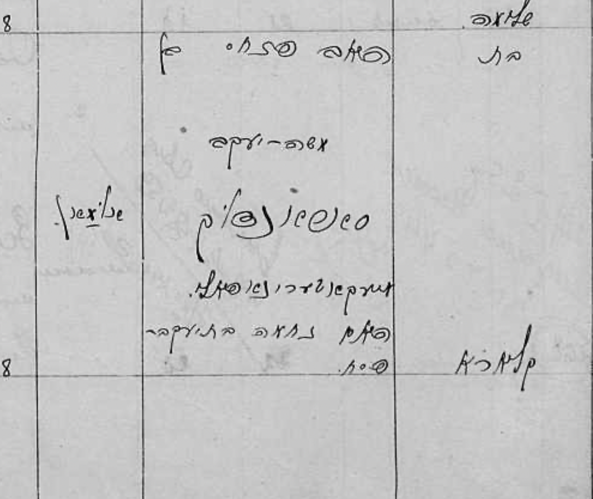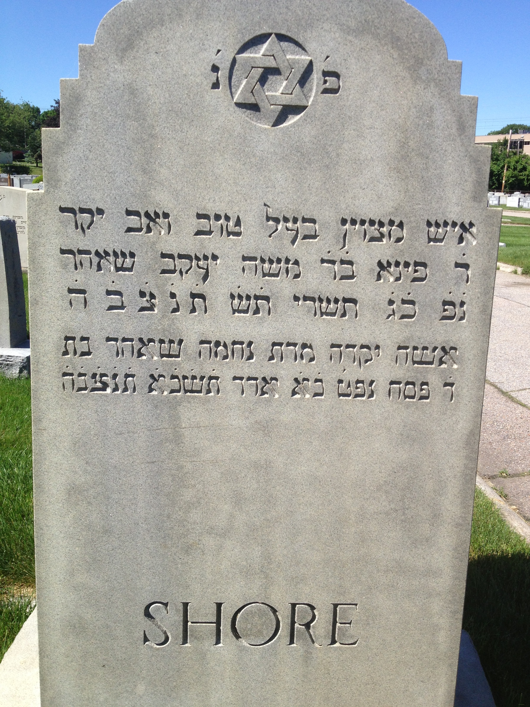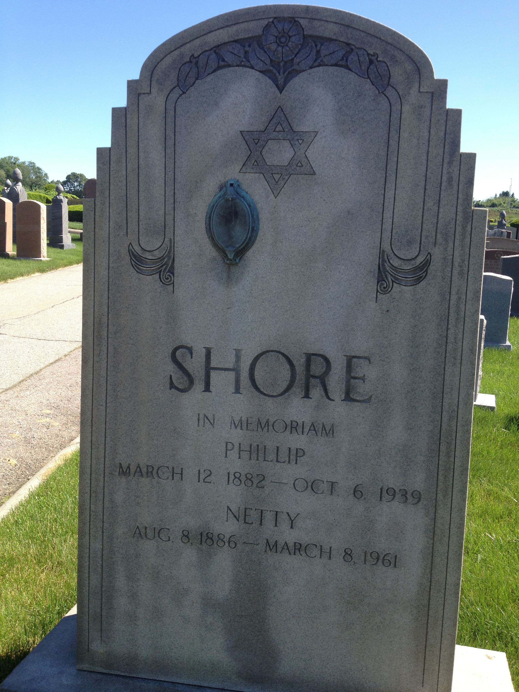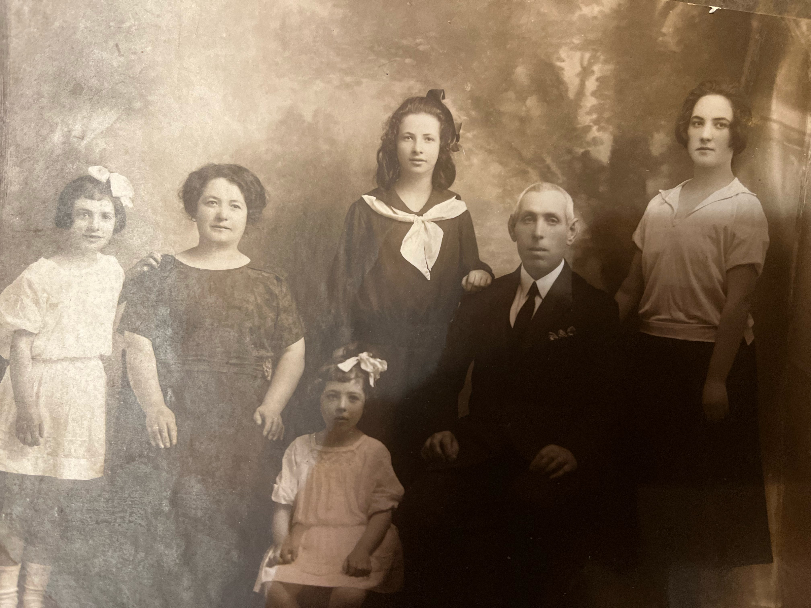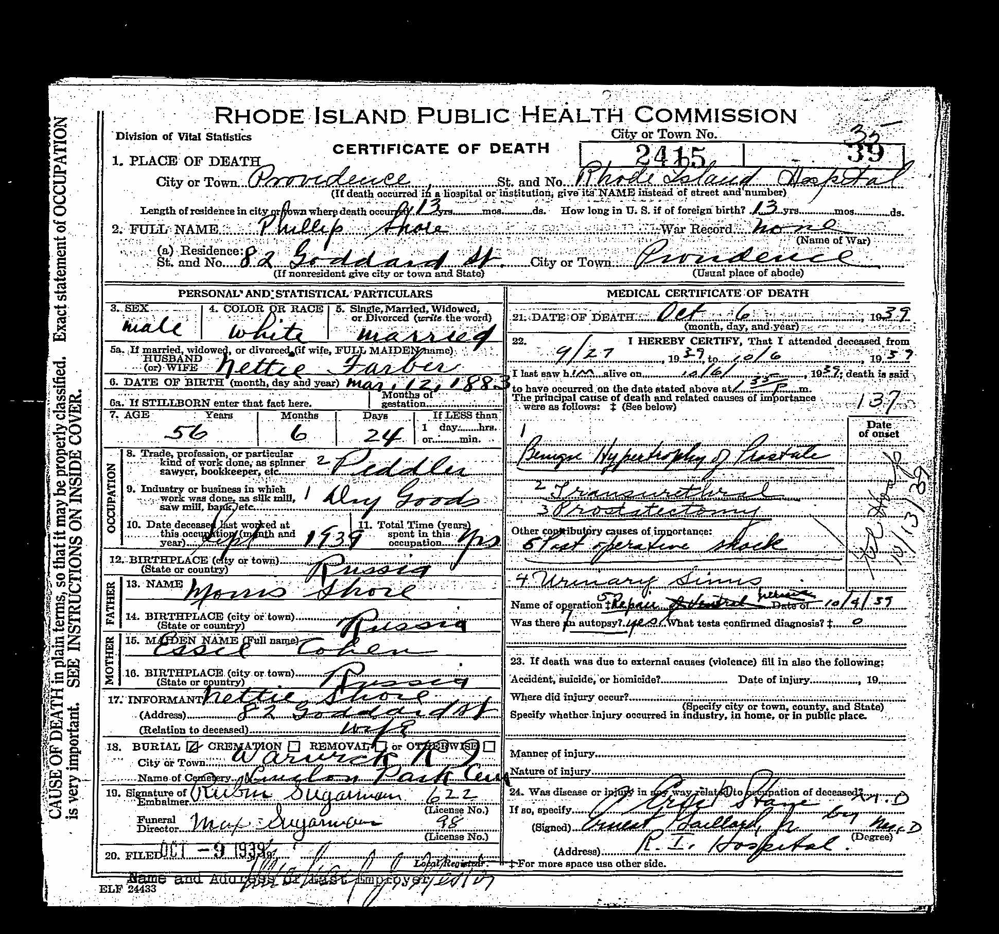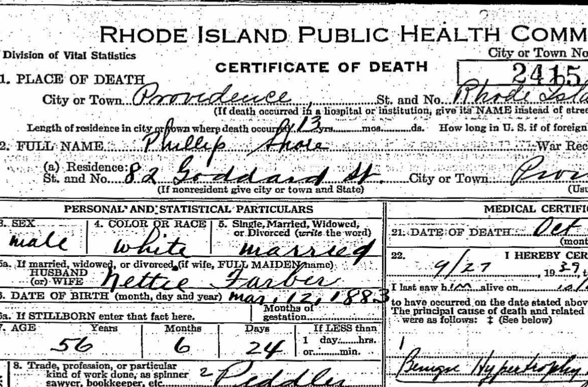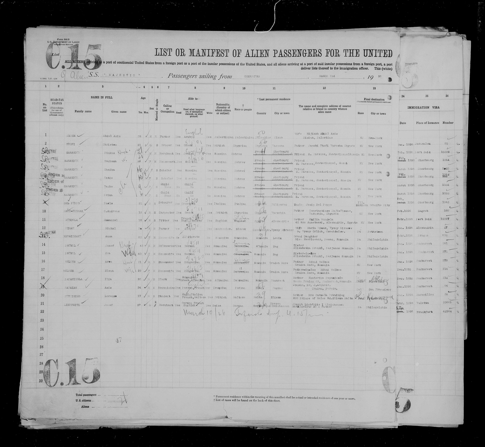
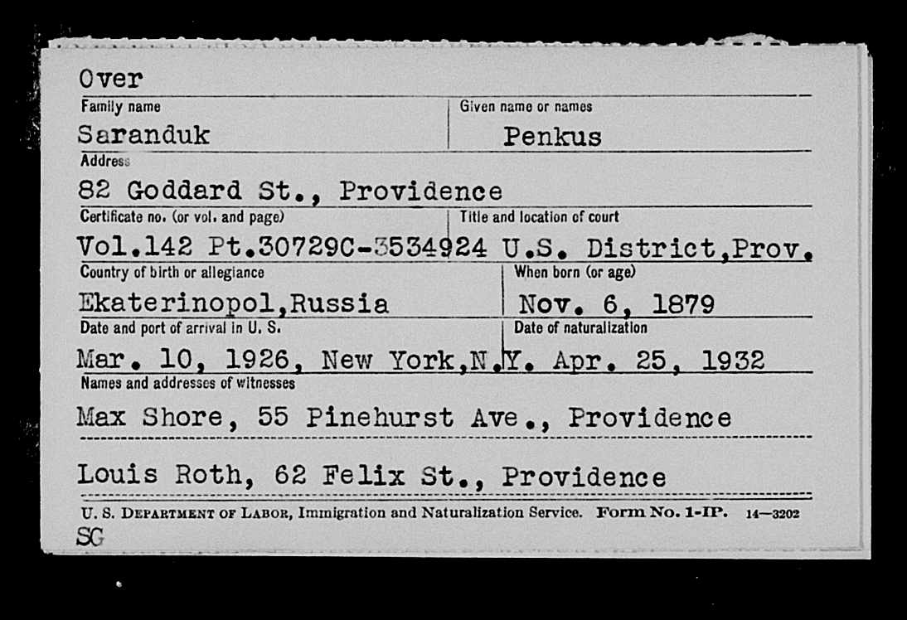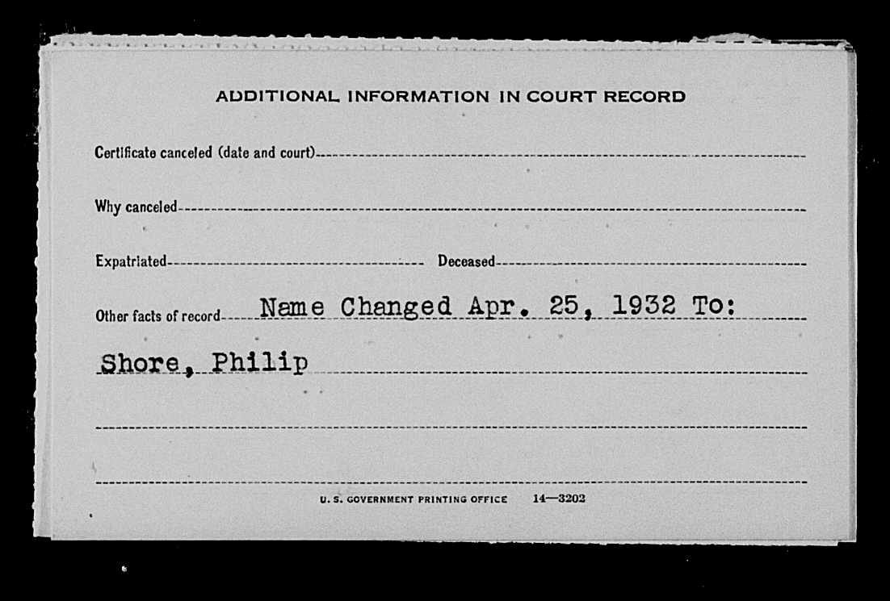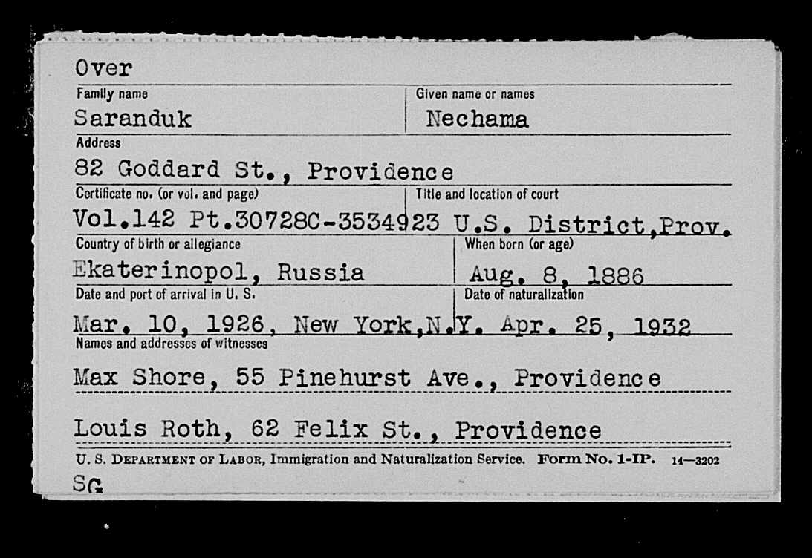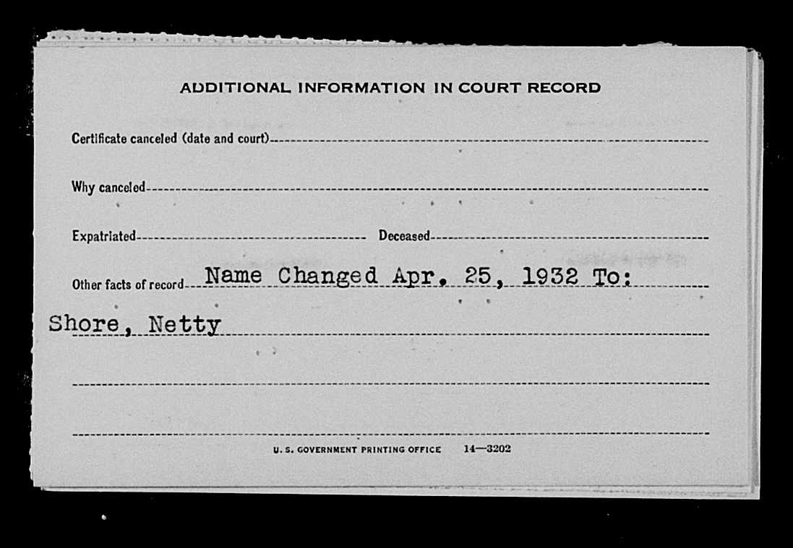

