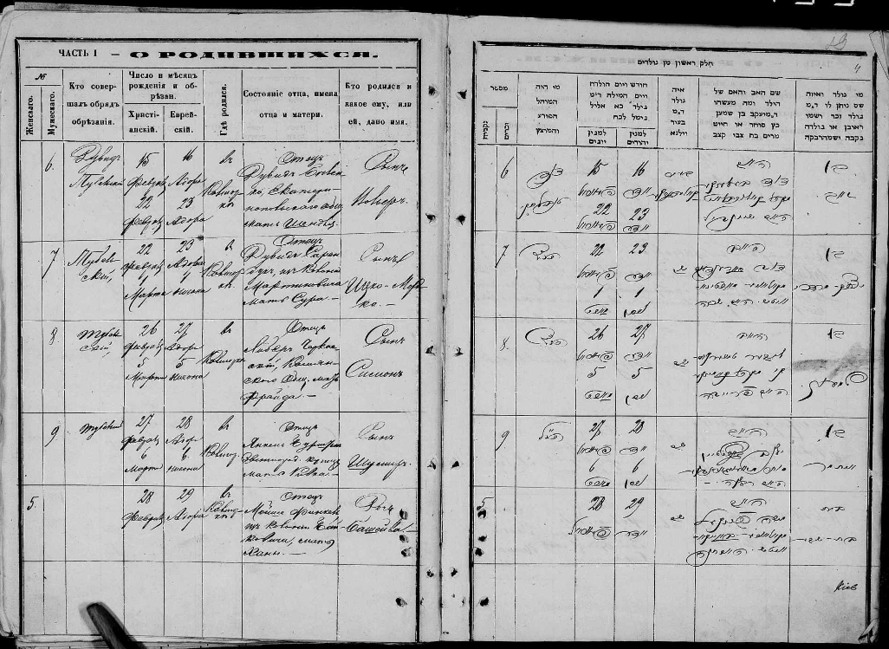
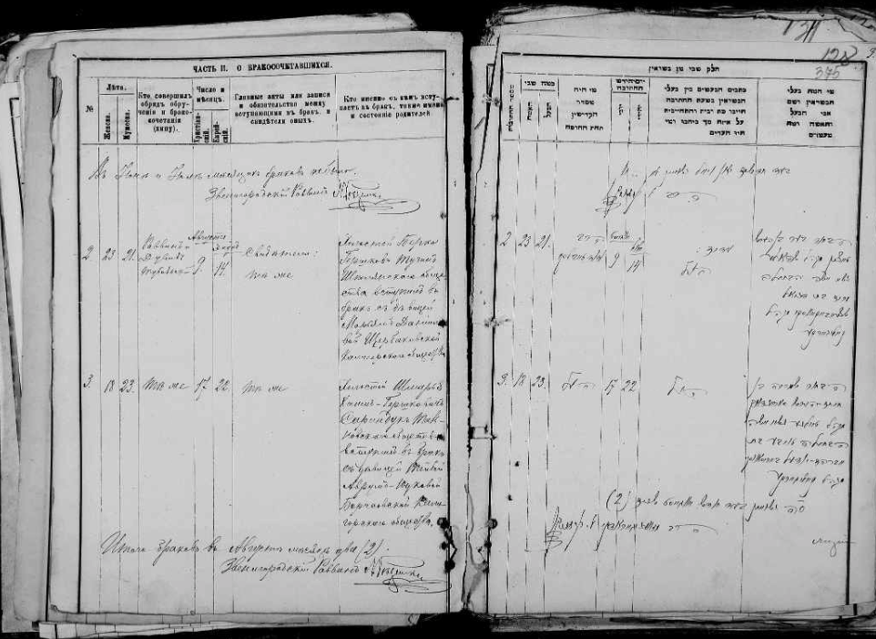
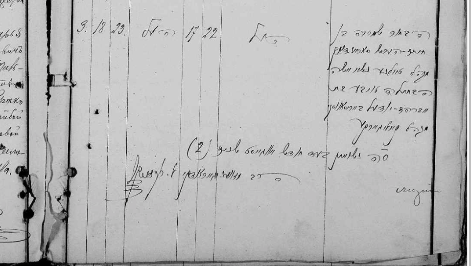
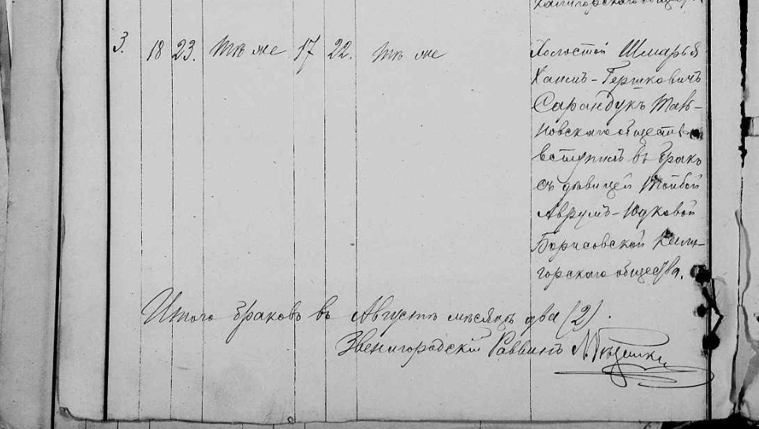

Getting to Mordko's side of the Saranduk clan, let's review the 1836 census entry we say last time, and review some of the other one's we haven't yet seen. Here is the 1836 entry from Torgovitsa for Mordko Saranduk's family:

Last Name: **Saranduk** \
Year: **1836** \
Town: **Torgovitsa** \
Uyzed: **Uman** \
Guberniya: **Kiyev**

| Given Name | Father's Name | Relationship to head of household | Sex | Age |
| ---------- | ------------- | --------------------------------- | --- | --- |
| Mordko     | Leyb          | Head of Household                 | M   | 42  |
| Rasya      |               | Wife of Mordko                    | F   | 36  |
| Gershko    | Mordko        | Son                               | M   | 23  |
| Khana      |               | Wife of Gershko                   | F   | 17  |
| Nakhman    | Mordko        | Son                               | M   | 17  |
| Srul       | Mordko        | Son                               | M   | 15  |
| Khana      |               | Wife of Nakhman                   | F   | 17  |
| Feyga      | Mordko        | Daughter                          | F   | 13  |
| Reyzya     | Mordko        | Daughter                          | F   | 12  |
| Khana      | Mordko        | Daughter                          | F   | 2   |

Here is an 1875 census entry for a Duvid Saranduk and his son Itsko Mordko.

Last Name: **Saranduk** \
Year: **1875** \
Town: **Mokra Kaligorka** \
Uyzed: **Zvenigorod** \
Guberniya: **Kiyev**

| Given Name   | Father's Name | Relationship to head of household | Sex | Age |
| ------------ | ------------- | --------------------------------- | --- | --- |
| Duvid        | Nakhman       | Head of Household                 | M   | 26  |
| Itsko Mordko | Duvid         | son                               | M   | 6   |

Now, it just so happens that I was able to find a birth record for an Yitzchok Mordechai born on February 22nd, 1869 to a Duvid and Sarah Saranduk. This is consistent with a 6 year old Yitzchok Mordechai in 1875. The record is from a collection called the [Cherkasy Church Books](https://www.familysearch.org/search/collection/4133834), put online by FamilySearch,

We know already that Mordko has a son named Nakhman, but is Duvid's father the same Nakhman? It's possible. Nakhman would be about 56 at the time.
It's plausible he had a 26 year old son named Duvid. But that's all I have.

We have another census entry, for a **Sarandukh** family in 1889 from Yelisavetgrad, Yelisavetgrad, Kherson. Many of the same names occur, but the dates don't seem to to match up. Note that this is a third variant of the spelling, **САРАНДУХ** not **САРАНДУК**.

Last Name: **Sarandukh** \
Year: **1889** \
Town: **Yelisavetgrad** \
Uyzed: **Yelisavetgrad** \
Guberniya: **Kherson**

| Given Name | Father's Name | Relationship to head of household | Sex | Age |
| ---------- | ------------- | --------------------------------- | --- | --- |
| Gershko    | Mordko        | Head of Household                 | M   | 69  |
| Leyba      | Gershko       | son                               | M   | 47  |
| Moshko     | Elish         | grandson                          | M   | 15  |
| Gersh      | Moshko        | great grandson                    | M   |     |
| Mordko     | Gershko       | son                               | M   | 15  |
| Nakhman    | Gershko       | son                               | M   | 10  |
| Duvid      |               | nephew                            | M   | 35  |
| Mordko     | Duvid         | relative                          | M   | 15  |
| Nakhman    | Duvid         | relative                          | M   | 10  |
| Khaya      | Yudko         | Wife of Moshko                    | F   | 21  |
| Khana      | Moshko        | great granddaugther               | F   |     |
| Khaya      | Duvid         | wife of Nakhman                   | F   | 54  |
| Sura       | Itsko         | wife of Duvid                     | F   | 35  |

Now, for example, if, as we've said in the last post, Gerskho was born in 1793, he would not be 69 in 1889, he would be 96! There are various other strange occurences in this entry. I found that in the original image, some of the the entries were crossed out - and it also seemed to me that the year was 1882, not 1889. Also Nakhman is 10 but has a 54 year old wife? This seems dubious. I'm looking into this entry further.

I took some notes of various other Saranduk births I found going through the Cherkasy Church Books. Here are the names:

| Name                                                                             | Gender | Father   | Father's Father | Mother  | Mother's Father   | Date           |
| -------------------------------------------------------------------------------- | ------ | -------- | --------------- | ------- | ----------------- | -------------- |
| [Yitzkhok Mordekhai](https://www.familysearch.org/ark:/61903/3:1:3Q9M-CSS4-YKVC) | M      | Duvid    |                 | Sarah   |                   | Feb 22, 1869   |
| [Pessi](https://www.familysearch.org/ark:/61903/3:1:3Q9M-CSS4-YVGD)              | F      | Shmaria  | Hyam Tzvi       | Toyba   |                   | July 1, 1889   |
| [Avram Elya](https://www.familysearch.org/ark:/61903/3:1:3Q9M-CS9N-CQZ8-G)       | M      | Yitzkhok | Duvid           | Dubrish | Yisroel Mordekhai | Jan 4, 1892    |
| [Rokhel](https://www.familysearch.org/ark:/61903/3:1:3Q9M-CSS4-YJ1X)             | F      | Duvid    | Nakhman         | Devora  | Eliezer           | April 12, 1895 |
| [Yisroel Nakhman](https://www.familysearch.org/ark:/61903/3:1:3Q9M-CS9N-CQHH-N)  | M      | Yitzkhok | Duvid           | Duba    | Yisroel           | Feb 1, 1895    |
| [Yisroel Moshe](https://www.familysearch.org/ark:/61903/3:1:3Q9M-CS9N-CQHH-D)    | M      | Duvid    | Nakhman         | Devora  | Eliezer           | July 4, 1897   |
| [Mendel](https://www.familysearch.org/ark:/61903/3:1:3Q9M-CS9N-CQH7-H)           | M      | Duvid    | Nakhman         | Devora  | Eliezer           | May 8, 1899    |
| [Klara](https://www.familysearch.org/ark:/61903/3:1:3Q9M-CSSH-LS9G-J)            | F      | Pinkhas  | Moshe Yaakov    | Nekhama | Yaakov Peysach    | Oct 20, 1909   |

Some note about these records:

1. As mentioned above, the first record is almost certainly the Itsko Mordko we saw in the Ukrianian Revision Lists. As such, despite the father's father's name not being recorded in the ledger, we know this was a Duvid son of Nakhman Saranduk.
2. A Yitzkhok son of Duvid Saranduk appears 3 times in this list. Once as a birth, twice as a father. Are they all the same Yitzkhok?
3. A father named Duvid appears four times on this list. The first time in 1869 as the father of Yitzchok Mordechai. Then three more times, with a different wife, in the 1890s. We know from the Revisions lists that all of the Duvids are Duvid son of Nakhman. Are they all the same Duvid son of Nakhman Saranduk?
4. The record for Pessi is almost certainly [Bessie Fishbein](https://www.findagrave.com/memorial/111379553/bessie-fishbein). Pessi is the Yiddish variant of the name Batya, which is the name that appears on Bessie's tombstone. The parents are also correct. The only thing to mention here is that on her tombstone it says she was born July 8th, 1889, while it says July 1st, 1889 on her birth record. Here parents are Sam and Tillie (Beresowsky) Shore.
5. The entry for Klara is almost certainly Irene Shore Roth. Her parents were Philip and Netty (Farber) Shore.
6. These records are in Hebrew and Cyrillic. My entries here are a transliteration, mostly of the Hebrew. There is various other information on these records, but the handwriting is often very bad and it is hard to decipher many things. An example of information that is on the original that I didn't include is the town they came from. I didn't include this because it is often hard to decipher and most of the town names have changed. But there is a lot of overlap with the towns on the birth records and the towns on the revision lists.

Finally, another finding from the Cherkassy Church Records - the wedding of [Shmaria/Sam and Toyba/Tillie Saranduk/Shore](https://www.familysearch.org/ark:/61903/1:1:6VTJ-ZSCH):

The event was to occur August 17th, 1888.

