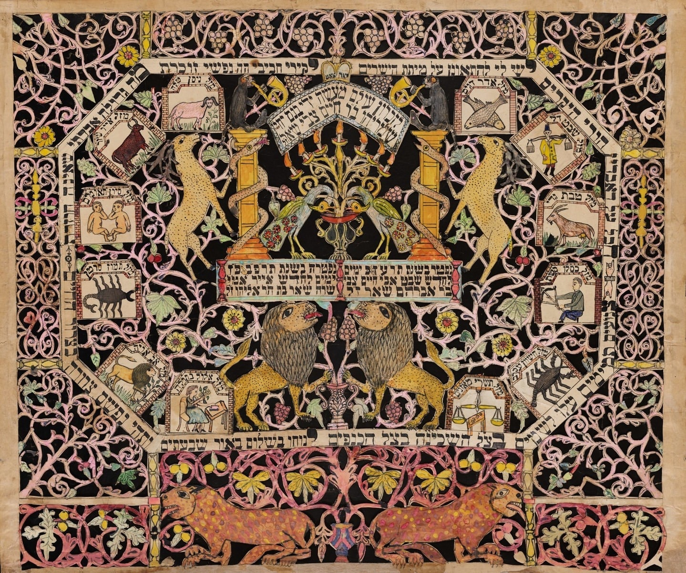

It would seem that in Ukraine our family name was Saranduk, but that this name was given by the Ukrainian ( or Russian ) authorities and used mostly for government documents etc. Not accepted by the family, who seemed to go by Shore.

The reason I think this is because this is what I’ve been told by Aunt Ruth, who was something of the family genealogist. She claims she was told this by her father, Samuel Oscar / Asher Shore. The claim checks out to me for two reasons:

1. I’ve found other cases of Jewish people who were named Saranduk immediately changed their surname to Shore upon arrival in to America (a Shore family in Missouri), with no known relationship or correspondence with our part of the family, which I take as evidence that they were in the same family.
2. All documents I found were of a government nature. Ukrainian census documents and Ellis Island ship manifests. I’ve never seen in any other context that a family member is referred to as Saranduk.

Aunt Ruth claimed her father told her they were given the surname Saranduk as a form of shaming by the Russians and as such didn’t keep it in America. I have asked native Russian and Ukrainian speakers who all claim there is no meaning to the name Saranduk.

_**UPDATE - Nov 9th 2023:** I've since found records going back to 1818 and Hebrew records with the name Saranduk on it. I've also found other Saranduk's maintain the name Serrin. I've also seen U.S. documents where the name Saranduk is used before changing it to Serrin or Shore. If the name Saranduk was just given for shaming it was applied quite consistently until we arrived to the States. This gives me pause. I think perhaps they just wanted a more American sounding last name 😉_

### Russian 1858 Census Document

We were able to find a 1858 Census document from Talne, Uman, Ukraine - which seems to contain the members of our family as Saranduk. The data in this census matches the data we found from ship logs, tombstones, and other records. As such, we identify the child named as Chaim Hershel - as Hyman Shore - see explanation below.

The census data says:

**Location**: Talnoye, Uman, Kyiv \
**Surname**: Saranduk \
**Year**: 1858

| Name         | Role              | Gender | Age | Father's Name |
| ------------ | ----------------- | ------ | --- | ------------- |
| Avrum        | Head of household | M      | 34  | Khaim         |
| Khaim Hersh  | Son               | M      | 9   | Avrum         |
| Moshe Yankel | Son               | M      | 6   | Avrum         |
| Khaya        | Wife of Avrum     | F      | 32  |               |

### The Gerty Ship Manifest

We see in the manifest of the S.S. Gerty, a ship sailing from Triest, August 18th, 1904 and arriving in NY on September 6th, 1904 - a passenger by the name of Chaim Hersch Saranduk - along with a whole bunch of other passengers with the same last name.

The relevant manifest data:

| NAME IN FULL          | AGE  | SEX | MARRIED OR SINGLE | CALLING OR OCCUPATION | NATIONALITY | RACE OR PEOPLE | LAST RESIDENCE      | FINAL DESTINATION | PASSAGE PAID BY | IN U.S. BEFORE |
| --------------------- | ---- | --- | ----------------- | --------------------- | ----------- | -------------- | ------------------- | ----------------- | --------------- | -------------- |
| Schmarje Saranduk     | 38   | M   | Mar               | Taylor                | Russia      | German         | Tolna, Kiev, Russia | Providence, RI    | myself          | no             |
| Tube Saranduk         | 33   | F   | Mar               | wife                  | Russia      | German         | Tolna, Kiev, Russia | Providence, RI    | husband         | no             |
| Pesi Saranduk         | 11   | F   | Single            | child                 | Russia      | German         | Tolna, Kiev, Russia | Providence, RI    | father          | no             |
| Dovodleb Saranduk     | 9    | M   | Single            | child                 | Russia      | German         | Tolna, Kiev, Russia | Providence, RI    | father          | no             |
| Wolke Saranduk        | 7    | M   | Single            | child                 | Russia      | German         | Tolna, Kiev, Russia | Providence, RI    | father          | no             |
| Uscher Saranduk       | 4    | M   | Single            | child                 | Russia      | German         | Tolna, Kiev, Russia | Providence, RI    | father          | no             |
| Yosi Saranduk         | 3    | M   | Single            | child                 | Russia      | German         | Tolna, Kiev, Russia | Providence, RI    | father          | no             |
| Yankel Saranduk       | 2(?) | M   | Single            | child                 | Russia      | German         | Tolna, Kiev, Russia | Providence, RI    | father          | no             |
| Chaim Hersch Saranduk | 55   | M   | Mar               | Taylor                | Russia      | Russian        | Tolna, Kiev, Russia | Buffalo, NY       | myself          | ~~yes~~ no     |
| Sura Saranduk         | 50   | M   | Mar               | wife                  | Russia      | Russian        | Tolna, Kiev, Russia | Buffalo           | husband         | ~~yes~~        |
| Beila Saranduk        | 30   | F   | Marr              | dressmaker            | Russia      | Russian        | Tolna, Kiev, Russia | Buffalo           | (?)             | ~~yes~~        |
| Rosa I Saranduk       | 19   | F   | Single            | private               | Russia      | Russian        | Tolna, Kiev, Russia | Buffalo           | father          | ~~yes~~        |
| Pessie Saranduk       | 6    | F   | Single            | private               | Russia      | Russian        | Tolna, Kiev, Russia | Buffalo           | father          | ~~yes~~        |
| Rosa II Saranduk      | 4    | F   | Single            | private               | Russia      | Russian        | Tolna, Kiev, Russia | Buffalo           | father          | ~~yes~~        |
| Moses Saranduk        | (?)  | M   | Single            | private               | Russia      | Russian        | Tolna, Kiev, Russia | Buffalo           | father          | ~~yes~~        |

### Chaim Hersch Saranduk

#### Matching the Census with the Ship Manifest

It is extremely likely that the Chaim Hersch Saranduk on the ship manifest is the same one from the Russian census. The person in the census was 9 in 1858. This would make him 55 in 1904 - which is consistent with the ship manifest. Also, there is no indication that the name Saranduk is a very common name. The idea that there would be two unrelated people named Chaim Hersch Saranduk, born in the same year in a shtetl the size of Tolna seems far fetched.

#### Matching Chaim Hersch Saranduk with Hyman Shore

As I've said, the family tradition is that the Russians called the Shores "Saranduk" as a form of shaming. We changed our name back to Shore when we left Russia. As such, it makes sense that the name listed is Saranduk.We know from Hyman Shore's tombstone and a papercut made by his son, that Hyman Shore's full Hebrew name was Chaim Tzvi ben Avraham. Hersch is the Yiddish version of the name Tzvi, and Avraham is listed as Chaim Hersch's father in the Russian census. Family tradition is also that the Shore's came from Tolne.

We know that Hyman Shore's wife name was Sarah, which is also consistent with the manifest.

We also know that Hyman Shore had a son named Shmaryahu / Sam. We know that Shmaryahu's wife's Hebrew name was Taube (based on her tombstone). We know that Shmarya and Taube had a daughter named [Bessie](https://www.findagrave.com/memorial/111379553/bessie-fishbein), a son who's Hebrew name was [Dovid Leib](https://www.findagrave.com/memorial/111379904/david-l-shore), a son name [Joseph (Yosef)](https://www.findagrave.com/memorial/111379638/joseph-shore), a son named [Jacob (Yaakov)](https://www.findagrave.com/memorial/111379503/jacob-shore), a son named [William](https://www.findagrave.com/memorial/184947465/william-shore), and a son named Oscar Samuel (Uscher). Shmarje, Tube, Pesi, Dovodleb, Wolke, Uscher, Yosi, and Yankel Saranduk all also appear on the manifest for the ship. We also know that the Hyman Shore had another son named Morris (Moshe) Shore, and a daughter Rose Shore Grossman, who are both buried nearby him in Lincoln Park Cemetery in Rhode Island. There are a Rose Saranduk and Moses Saranduk listed as his children on the ship manifest.

Some odd things to note. In all likelihood, all of these Saranduk's are related, and they all come from the same shtetl in Russia (present day Ukraine), so it is odd that the one's going to Buffalo are of the "Russian" race, and the one's going to Providence are of the "German" race. Also, I'm not yet sure why they're going to Buffalo.

### Lincoln Park Cemetery, Warwick, RI

There are 2 generations of Shores buried in Lincoln Park Cemetery in Warwick, RI

#### Hyman (Tzvi) and Sarah Shore

1.  [Hyman](https://www.findagrave.com/memorial/110576964/hyman-shore):
    1. חיים צבי ב״ר אברהם שאר.
    2. Died Feb, 12, 1912 3. נפטר כ׳ שבט תרע״ז 4. Hebrew date and English date do not match. Hebrew date suggests that the date of death was Feb 12, 1917 (_not_ 1912).
    3. Find A Grave claims that Hyman was born in 1860. I do not not what the source for this is. I have found a [Ukrainian census record from 1858](https://www.jewishgen.org/databases/jgdetail_2.php?df=668804e1-5ba5-4884-b98a-263691a3f226&georegion=00ukraine&srch1=Saranduk%20&srch1v=S&srch1t=Q&srchbool=AND&dates=all&newwindow=0&recstart=0&recjump=0&saved=1) which reported has a household were someone name Avrum Saranduk in Tolne has a son name Khaim Ghersh (חיים הירש) is a variant of חיים צבי who is 9 years old. This would make him born in 1849 (11 years prior). This birth date checks out with the ship manifests which claim he was 55 in 1904.
    4. Inscription on tombstone: Our honored father, A man of modest ways, God fearing, Sabbath observer, beloved to all
    5. אבינו הנכבד איש הצנע לכת ירא שמים שומר שבת אהוב לבריות.
2.  [Sarah](https://www.findagrave.com/memorial/110576980/sarah-shore):
    1. שרה בת ר׳ אליהו
    2. Died June 4th 1921
    3. Poetic non typical(?) tombstone inscription based on Song of Songs
    4. אמינו החביבה דגולה מרבבה ודגלה עלינו אהבה
    5. Our beloved mother, (an) exceptional (person), showered us with love. (Rough translation, both דגול מרבבה and דלגו עלי אהבה are from Song of Songs)
3.  There is a paper cutting, made by their son Sam / Shmaryahu Shore, preserved at the Museum of Fine Arts in Boston, which commemorates the his parents, which commemorates the same dates of their passing.
4.  They seems to have had at least two other children besides Sam / Shmaryahu, also buried at Lincoln Park Cemetery:
    1. [ Morris / Moshe Shore](https://www.findagrave.com/memorial/111379176/morris-shore)
    2. [Rose / Raizel (Shore) Grossman](https://www.findagrave.com/memorial/202408296/rose-shore-grossman)

#### Sam and Tillie Shore

1.  [Sam](https://www.findagrave.com/memorial/111379786/sam-shore):

    1. Tombstone
       1. שמריהו ב״ר חיים צבי
       2. Died April 30, 1944
       3. age 76
       4. rough translation of Hebrew inscription: Here lies a man with a generous heart who laid a good foundation for the benefit of his people, Shmariahu ben Chaim Tzvi Shore. Died on the 7th of Iyar 5704 ת.נ.צ.ב.ה.
    2. Art
       1. Various artwork
          1. Astrological motifs
          2. Jewish themed
          3. Paper cutting and murals
          4. Knew at least enough Talmudic Hebrew to write an acrostic poem commemorating his father in a commemorative paper cut of his father.

2.  [Tillie](https://www.findagrave.com/memorial/111379712/tillie-shore):
    1. טויבא בת ר׳ חיים אידל
    2. Died Jan 19, 1954
    3. נפטרה כ״ז אייר תרפ״א
    4. Age 82

