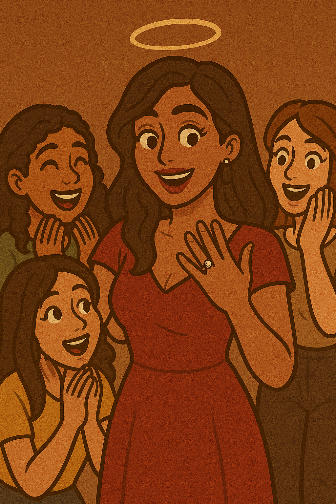
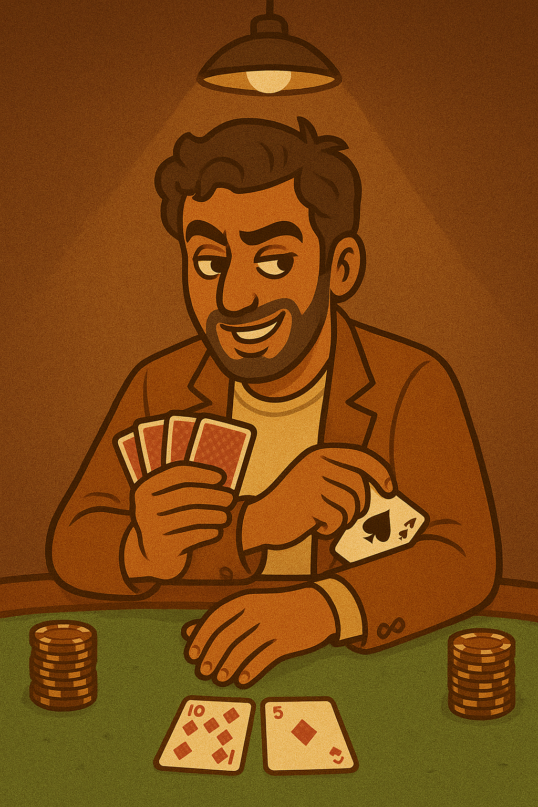
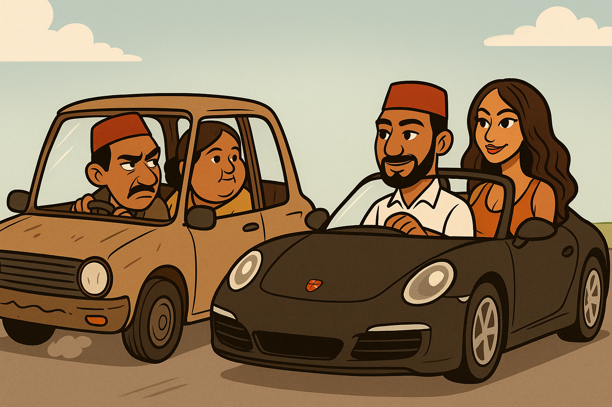
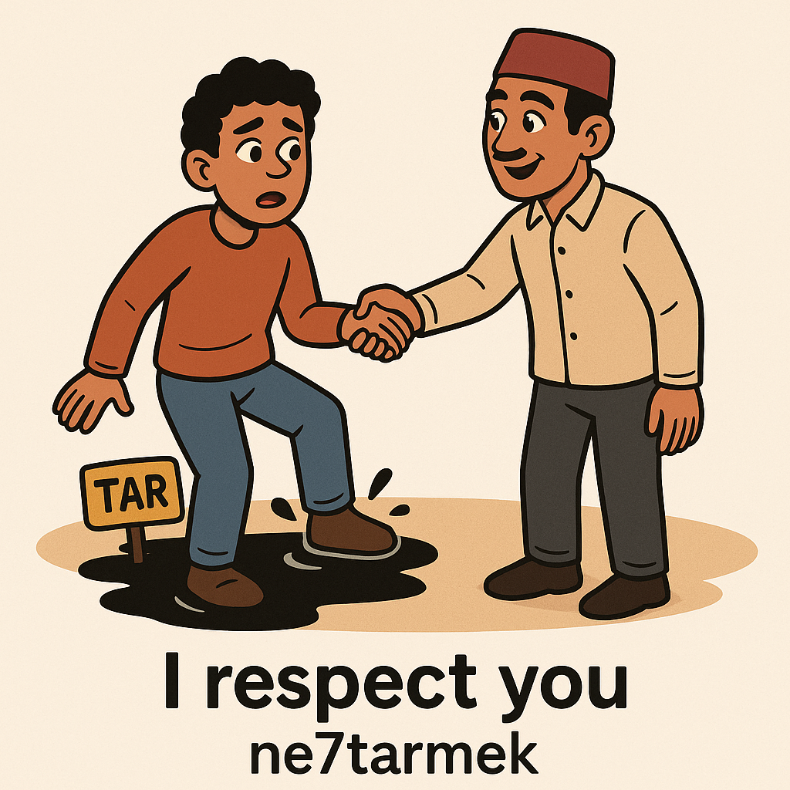
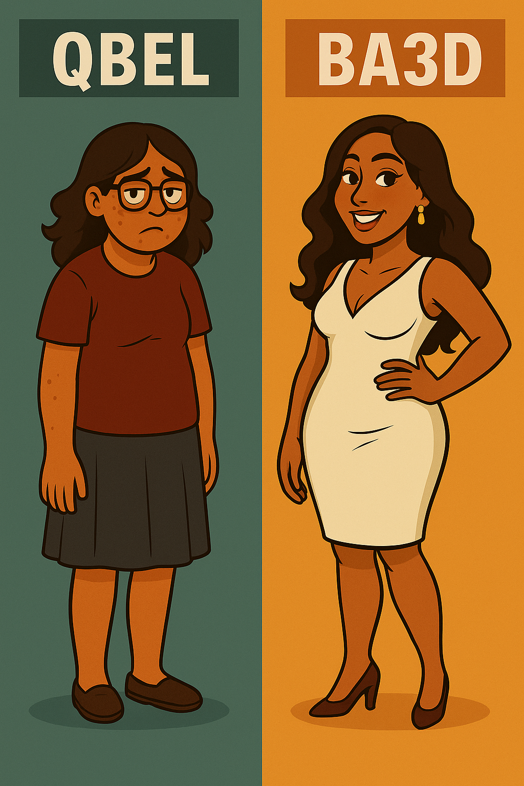
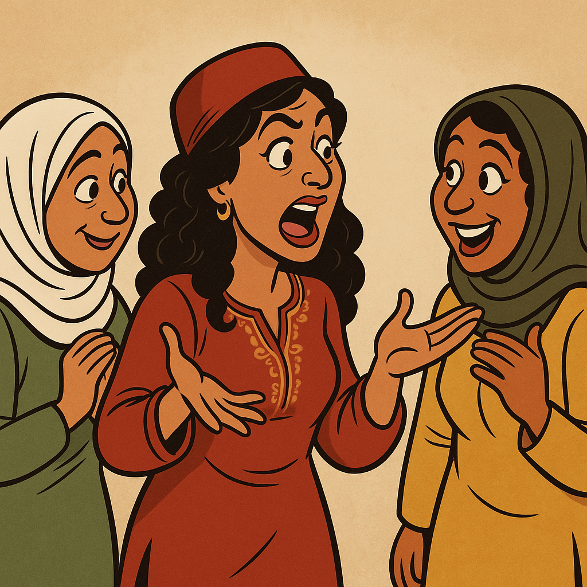
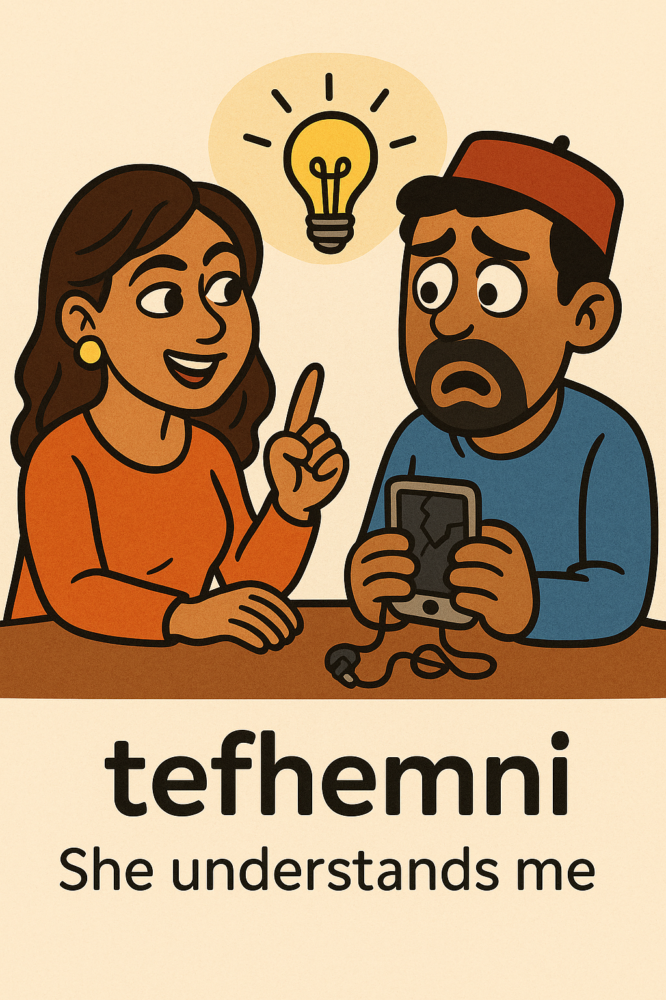
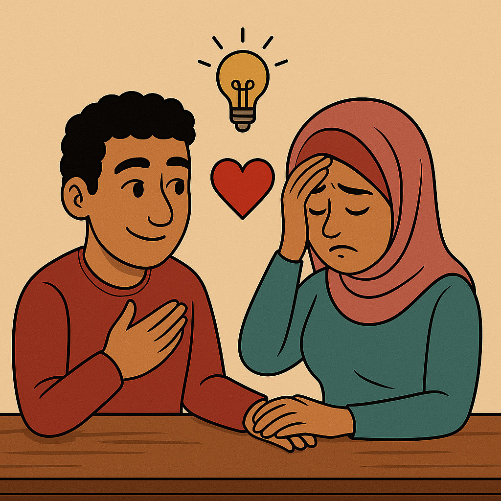
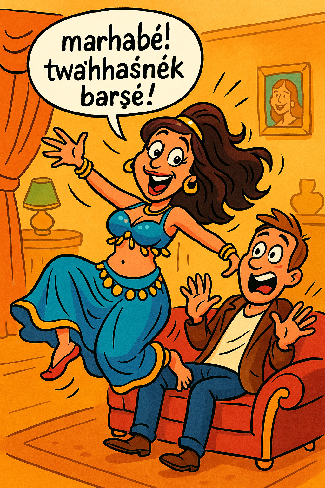
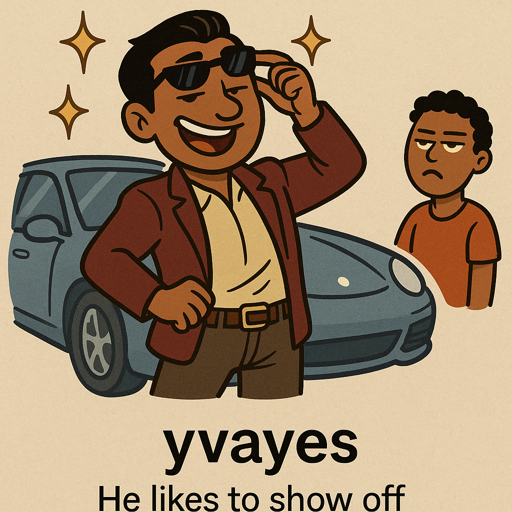

I wanted to make some images for my Anki cards to incorporate mnemonics and have a visual element to help with retention. I didn't want to draw them by hand as I haven't really had time to illustrate things lately - so I used various AI tools. Originally, I used DaVinci - but that was terrible. Eventually I had DALL-E 3 inside GPT-4o generate the images for me. I received a lot of odd lecturing about body shaming and restrictions - but eventually I got something usable.

For much of this my pronounciation is very off. I apologize for any confusion caused.

| English                            | Tunisian                           | Audio | Sentence | Image                     |
| ---------------------------------- | ---------------------------------- | ----- | -------- | ------------------------- |
| wedding                            | 3irs                               |     <audio controls src="wedding.m4a"></audio>  |          |              |
| engaged (female)                   | ma5touba                           |   <audio controls src="engaged.m4a"></audio>    |          |       |
| cheating                           | 5iyena                             |    <audio controls src="cheating.m4a"></audio>   |          |         |
| jealous                            | moġyar / moġyara / ġayer / ġayera |      <audio controls src="jealous1.m4a"></audio> <audio controls src="jealous2.m4a"></audio> <audio controls src="jealous3.m4a"></audio> <audio controls src="jealous4.m4a"></audio>|          |        |
| i respect you                      | ne7tarmek                          |   <audio controls src="i-respect-you.m4a"></audio>    |          |       |
| before / after                     | qbel / ba3d                        |    <audio controls src="before.m4a"></audio> <audio controls src="after.m4a"></audio>   |          |        |
| gossiper                           | t9al9il                            |   <audio controls src="gossiper.m4a"></audio>    |          |           |
| she understands me                 | tefhemni                           |    <audio controls src="she-umderstands-me.m4a"></audio>   |          |     |
| he understands me                  | yefhemni                           |    <audio controls src="he-understands-me.m4a"></audio>   |          |        |
| welcome back! we missed you a lot! | marhabe! twahhasnek barsha!        |  <audio controls src="welcome-back.m4a"></audio>     |          |  |
| he shows off                       | yvayes                             |    <audio controls src="show-off.m4a"></audio>   |          |            |
