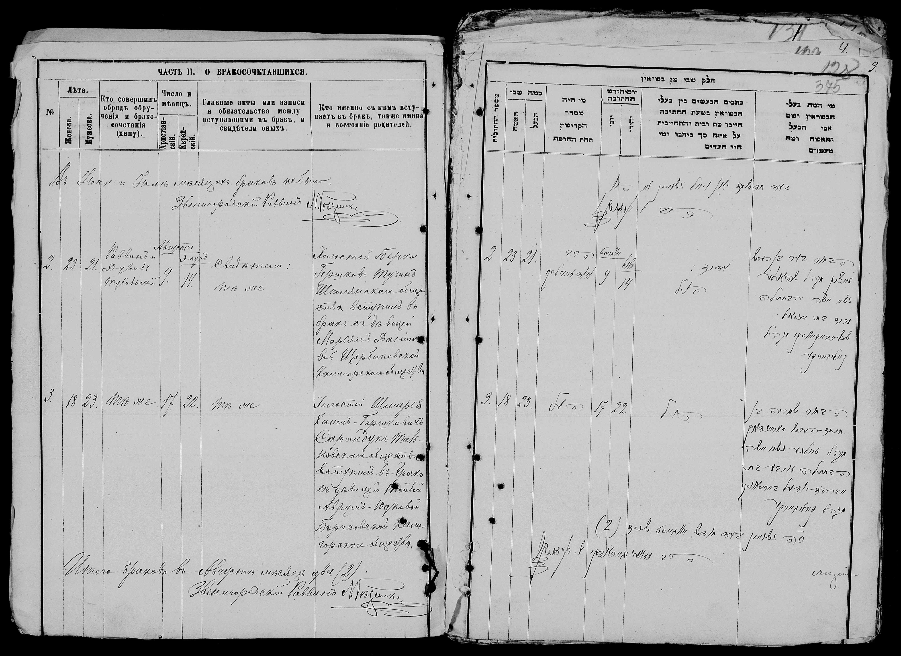

### Quick Facts

| Key        | Value                                              |
| --------   | ----------------------------------------------     |
| Parents    | Avraham Edel Beresowsky, Rachel Bockman            |
| Birth      | August 1st, 1871                                   |
| Birthplace | Kalniboloto (Katerynopil)  / Mokra Kaligorka       |
| Spouse     | [Sam Shore](/post/the-80th-yahrtzeit-of-shmariahu-shore/) |
| AKA        | Taube Saranduk / Shore                             |
| Death      | January 19, 1954                                   |
| Yarhzeit   | Shvat 15 (Tu b'Shvat 5714)                         |
| Burial     | Lincoln Park Cemetery, Warwick, RI.                |

---

flowchart TB;
  AEB[Avraham Edel Beresowsky] --> mAR((❤️))
  RB[Rachel Bockman] --> mAR((❤️))
  mAR --> TB((Taube - Tillie Beresowsky))

  CSS[Chaim Svi Saranduk] --> mCSTB((❤️))
  SM[Sura Mamorofsky] --> mCSTB((❤️))
  mCSTB --> SS[Shmaria - Sam Shore]

  TB --> mTBSS((❤️))
  SS --> mTBSS((❤️))

  mTBSS --> BF[Bessie Fishbein]
  mTBSS --> D[David L.]
  mTBSS --> B[Bill]
  mTBSS --> J[Joseph]
  mTBSS --> JB[Jacob]
  mTBSS --> A[Albert]
  mTBSS --> OSS[Oscar Samuel Shore]

  OSS --> mOSTS((❤️))
  TS[Teresa Slustky] --> mOSTS((❤️))

  mOSTS --> AL[Albert P.]
  mOSTS --> HS[Harold]
  mOSTS --> R[Ruth]


This coming Thursday is the Jewish Holiday of Tu b'Shvat - the new year for fruit of the tree. The main significance of this Holiday is related to tithing, but there are various Jewish customs also connected with it. But besides its significance in tithing, the 15th of Shvat is also significant to the Shore family as it is the Yahrzeit (anniversary of the passing) of Taube Shore. This coming Thursday (starting Wednesday evening) will mark her 71st Yahrzeit.

### Taube's Home Town

My father's cousin, Shmaria (Tillie's husband's namesake), has shared some note he took while researching the family history.

In his notes, Shmaria says that Tillie / Taube and her brother, David, "came from a small town near [Tolna](https://www.jewishgen.org/ukraine/GEO_Town.asp?id=156) called Kaliblotot". Originally I have had assumed that the name of the town referenced was [Kal'nybolota, Kirovohrad Oblast, Ukraine](https://www.jewishgen.org/ukraine/GEO_town.asp?id=24). This town is about an hour drive from Talne. Seems like an open and shut case. However, like all things Ukrainian Geography, **nothing** is **ever** straightforward. There is another town, about half an hour drive from Talne call [Yekaterinopol](https://www.jewishgen.org/ukraine/GEO_Town.asp?id=101) which used to be called Kalniboloto by the Russians. Supposedly, based on the forums in JewishGen, it was still called that amongst Jews at the time. 

As mentioned earlier, a few years ago, I discovered a record of Shmaria and Taube's marriage in the Cherkassy Records (image below). [Mokra Kaligorka](https://www.jewishgen.org/ukraine/GEO_Town.asp?id=121) is the town listed as the town of the bride. At [jewua.org](https://jewua.org/mokra-kaligorka/) it claims that "Mokra Kaligorka is town (_sic_) of the Katerinopol district, Cherkassy region."

On the S.S Gerty (the boat they immigrated to America on) manifest it lists her brother, D. Beresowski as the relative they are joining in America. David Beresowsky eventually changed his name to Boren. I've found a [1875 census record from the town of Mokra Kaligorka](https://www.jewishgen.org/databases/glue_s2.php?test=Y&rec=668804e1-5ba5-4884-b98a-263691a3f226_1342888) on JewishGen, where there is an Avrum Yudko Borisovskiy with 3 sons, one of whom is named Duvid. This would seem to be a record of David Boren. However, on his death certificate (image below), it says that David was born in 1875, and in the census record it claims he was 6 years old at the time, so it's unclear that the census record is a match. 

| Surname     | Given Name  | Father       | Relation to Head of Household | Sex | Age |
| ----------- | ----------- | ------------ | ----------------------------- | --- | --- |
| Borisovskiy | Avrum Yudko |              |    Head of Household          | M   | 43  |
| Borisovskiy | Ioizip      | Avrum Yudko  |     Son                       | M   | 10  |
| Borisovskiy | Moshko      | Avrum Yudko  |     Son                       | M   | 8   |
| Borisovskiy | Duvid       | Avrum Yudko  |     Son                       | M   | 6   |

There is also a record of [Bessie Fishbein's (Pessi) birth](https://www.jewishgen.org/databases/glue_s2.php?test=Y&rec=b677b88f-242d-45e5-9e25-73d3466a387b_0815267) from July 1st, 1889 from the town of Mokra Kaligorka (image below). So it would seem there was some connection with the Beresowsky family and Mokra Kaligorka. (It notes there that the father comes from Talne.) 

_NOTE: On Bessie Fishbein's tombstone, it says she was born July 8th 1889. This conflicts with the record of birth saying she was born July 1st._

#### Taube's Parents

Shmaria's notes reference mention that Taube's parents were divorced. He says that here father Avrum Edel ran a tavern, and "died from a shot of whiskey". He also references a family legend that Tillie's mother died on the boat on the way to America because she wouldn’t eat non kosher food. According to the legend, she was then thrown off the boat with a note stating that the body was that of a Jewish woman and a request to whoever finds her to bury her in Israel. The story goes on to claim that they later "received a note" confirming the body was found and sent to Israel for burial. I have heard this story in various forms before from my father and Auth Ruth.

### Accounts of Taube

While there is quite a few accounts of Shmaria - I've heard very few accounts of Taube. My father told me, and it appears in Shmaria's notes, as well as in Aunt Ruth's notes (a record of an email from Barrie Shore), that her sons hired an old Jewish man to live with Shmaria and Taube and play gin rummy with Shmaria so that he wouldn't wake up Taube. In Aunt Ruth's writings she writes that she spoke in Yiddish and didn't speak English well at all. In Shmaria's notes he writes that Shmaria taught Taube to roll cigarettes and used to take her out dancing. 

May her _neshama_ have an _aliyah!_ (May her soul be elevated!)

