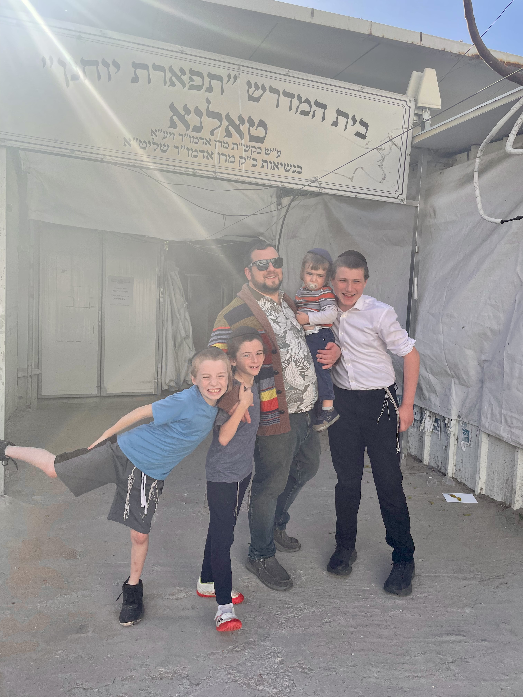

## Setting Out for Ashdod

Last Wednesday night, a little after 8:00, I packed my three oldest boys—14, 11, and 9—into a city car and headed south. They'd been excited about this trip all week: the yahrzeit gathering in Ashdod for Reb Duvid of Talne, the original Tolna Rebbe. This wasn't a spontaneous thing. Back during Passover, we visited Ashdod and met the current Tolna Rebbe. When I mentioned our family's roots in Tolna, his eyes lit up. He told us that after the war, there weren't many Tolna families left who were still observant. He gave me some of the seforim of the original Tolna Rebbe and asked me to return for the yahrzeit, along with any documentation I had of our family's Tolna origins.

## Unfamiliar Yet Familiar

We arrived right on time and stepped into a synagogue full of Hasidim. We stood out immediately—definitely the only non-Hasidic family in the room. My boys weren't fazed. They watched, listened, and absorbed the singing and the unique energy. The Rebbe spoke in Yiddish. I did my best to quietly translate the important pieces, but mostly my kids were content just to observe, happy to be part of something that connected to our heritage.

## Recognition and Roots

Towards the end of the ceremony, the Rebbe's gabbai found us and asked us to wait. A few minutes later, we were ushered into the Rebbe's room. He remembered our visit from Passover and was eager to see the documentation I'd brought. I handed over copies of the Cherkassy Church records, ship manifests to Ellis Island, and old U.S. citizenship forms. The Rebbe looked through everything, asked thoughtful questions, and kept copies for his records. He gave us his blessings, and, switching to Hebrew so my sons could understand, offered words of encouragement. It was a small but meaningful moment—being recognized as a living link in the Tolna chain, a branch of the 19th-century Chernobyl dynasty that Rav Duvid Twersky helped build in Ukraine.

## Wrestling With the Mystical

I should be honest: my skepticism about Hasidism and Kabbalah isn't something new. For years, I've looked at these traditions with a critical eye, especially when it comes to the Zohar and the foundations of Jewish mysticism. Recently, over Shabbos, I finished Luzzato's *הוויכוח*, a pointed critique of the Zohar that questions its language, timeline, and logic. I don't easily dismiss his arguments.

This is the personal tension: Even as I question these mystical ideas and their origins, the reality is that Kabbalah is so completely woven into Orthodox Judaism that these debates have mostly become academic. Practically, you can't really extract Kabbalistic influence from halachic Judaism—so much is intertwined, from rituals to theology to the language of faith itself. Unless the Jewish world agreed to collectively reset to the year 1400, there's no realistic way to separate out what's Kabbalistic and what isn't.

So I find myself always balancing between my own honest beliefs and my place within an Orthodox community. I don't have a satisfying answer. The tradition has spoken—not through debate, but through centuries of lived experience. My doubts don't change the fact: Kabbalah is part of what I've inherited.

## Tradition, Doubt, and Showing Up

Standing in that Ashdod synagogue with my boys, I realized that showing up—even when you don't have all the answers—is itself an act of faith. This, more than anything, is what I hope to teach my kids: that it's okay to approach tradition with questions, and it's still meaningful to participate. Sometimes belonging means wrestling with the past rather than accepting it at face value.

The Rebbe made a siyum on Tractate Makkos for the yahrzeit and shared a passage:

> Habakkuk came and established all 613 mitzvos on one as it says: "But the righteous person shall live with his faith."
> — Makkos 24

He explained, quoting the Zohar, that Habakkuk is the son revived by Elisha in the book of Kings. The key point: Elisha's initial hope that the woman's merit—her support—would revive her son wasn't enough. It was her faith, not just her actions, that ultimately brought new life. Especially the merit of her having faith even when she had very good reasons to question that faith. That's why Habakkuk, who according to the Zohar is the son Elisha revived, could later say, "the righteous person shall live (or enliven) by his faith."

_NOTE: This is not a review of what was said - I'm just including what's necessary._

Faith—its central challenge and its necessity—runs through all of Reb Duvid of Talne's works. After the Rebbe's words, the message hit home: faith is complex, sometimes even defiant, but it keeps tradition alive.

## What I Hope They Remember

Driving home, the boys tired but talkative, I hoped what would stay with them wasn't just the novelty of sitting in a Hasidic synagogue, or being recognized as part of an old Ukrainian lineage. I hope they'll remember that even if faith is complicated, showing up matters. Wrestling with heritage—bringing your questions along for the ride—is itself a form of belonging.

