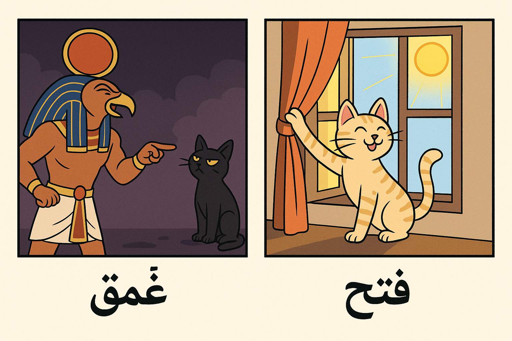

## Pivot to Tunisian

First of all, I feel I should address the fact that I’ve been studying Tunisian Arabic and not Moroccan Arabic. I have two opposing goals with my Arabic study and I’ve decided to put the Moroccan on hold in favor of Tunisian for the time being.

Regardless of dialect, here are some tweaks I’ve been making to my study methods lately.

## Anki Flashcards

Anki remains the core of my vocab acquisition. I’m using the [Lingualism](https://lingualism.com/product/tunisian-colloquial-arabic-vocabulary-anki-flashcards) Tunisian Colloquial Arabic deck as a base, and supplementing it with material from my [Preply](https://preply.com/en/?pref=MTg3MDQ0NzU=&id=1746597517.921381&ep=w) tutor. After each lesson, I paste the worksheet into [ChatGPT](https://chatgpt.com/) and have it generate a CSV formatted for Anki import. Each lesson gets its own deck. This cuts out the friction of manually creating flashcards, which is the kind of busywork that usually kills follow-through.

When I first encounter a card, I try to record myself saying the word or phrase. I don’t do this in Anki—I do it in Obsidian (see below) and link the audio file back to the card. I then send the recordings to my tutor for feedback.

I also use mnemonics and image occlusion when a word doesn’t stick. Example: I kept forgetting the words for “dark” (غمق *ghamaq*) and “light” (فتح *fetaH*). So I had ChatGPT generate a cartoon of the Egyptian god Ra mocking a dark cat ("Ra mock" → *ghamaq*) and a light cat opening something ("liftoaḥ" in Hebrew). The Anki card uses image occlusion to hide the answers.

The goal is multi-sensory memory: sound, image, word, meaning—all in one place.

## YouTube

I need regular exposure to natural Tunisian speech to train my ear. I tried watching *Choufli Hal*, but I’m not at the level where I can understand any of it—too fast, too idiomatic.

What’s been more useful is the [Easy Tunisian Arabic](https://www.youtube.com/playlist?list=PLA5UIoabheFNOtcQmuLyQedp7jDDp2Bif) playlist. They speak slowly and clearly in basic Tunisian Arabic with subtitles. It’s not glamorous, but it’s effective.



## Obsidian

Obsidian is where I organize everything else. I log each tutoring session as a note, tag new vocab, and embed audio of myself speaking. It’s where I track what I got wrong, what I forgot, and what I need to revisit.

I also draft example sentences, break down dialogues, and build out my own phrasebook using embedded notes and links. It’s basically my workspace for anything that isn’t flashcard repetition. Once I’ve cleaned something up or added audio, I’ll push it into Anki.

Obsidian handles depth and review. Anki handles spaced repetition. The combo works.

**An added benefit**: because Obsidian is basically a Markdown editor - many of the posts about Tunisian, in fact, many of my posts in general, come straight out of my Obsidian notes.
