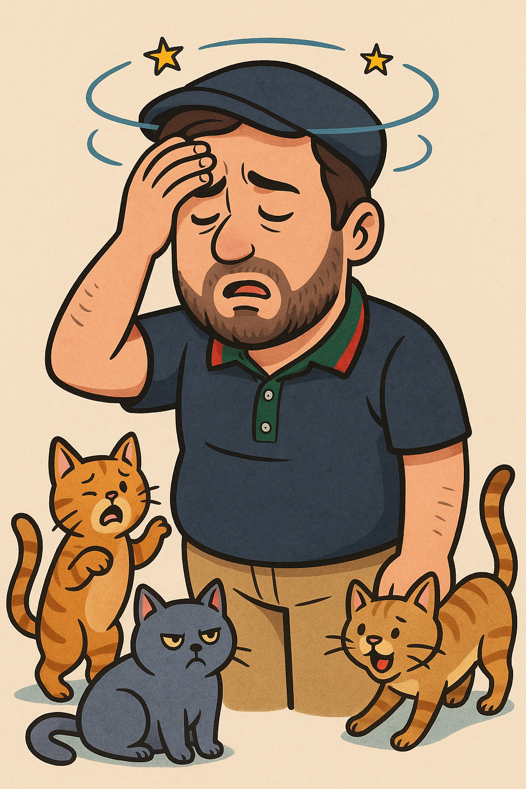

_**UPDATE May 30th, 2025**: I've added audio for the first dialogue. Feel free to correct my pronunciation in the comments._

## Dialogue One: Jacob and Omar

A simple dialogue between Jacob and his friend Omar

---


_Jacob w sa7bou Omar yerte7ou fi 9ahwa ytkalmou m3 ba3dhom._

| Dialogue | Audio |
| --- | --- |
| **Jacob:** Shnawellek Omar? 9adesh 3andi ma chofteksh! } | <audio controls src="Recording 20250530145158.m4a"></audio> |
| **Omar:** Ena labas! ama n7es fi rou7hi fedd barsha! Shnowa t7eb t3mal? | <audio controls src="Recording 20250530145239.m4a"></audio> |
| **Jacob:** Taw, ena n7eb nshrab 9ahwati, w ba3d ma tw nkhamou fi haja na3mlouha. Bish tshri 9ahwa, Omar? | <audio controls src="Recording 20250530145422.m4a"></audio> |
| **Omar:** La, man7ebsh 9ahwa, bish nhabat tey. | <audio controls src="Recording 20250530145437.m4a"></audio> |
| **Jacob:** Bahi! Sa7a!  | <audio controls src="Recording 20250530145452.m4a"></audio> |
|   **Omar:** ya3tik sa7a. | <audio controls src="Recording 20250530145502.m4a"></audio> |

*Jacob w Omar yekalamou w yekemmlou mashrabouthom.*

| Dialogue | Audio |
| --- | --- |
| **Omar:** Walla, shouwa n3malouha taw? | <audio controls src="Recording 20250530145717.m4a"></audio> |
| **Jacob:** Nemshiw lel b7ar w n3oumou ghadi! | <audio controls src="Recording 20250530145734.m4a"></audio> |
| **Omar:** Behi barsha! Ena n7eb l-b7ar! | <audio controls src="Recording 20250530145746.m4a"></audio> |

## Dialogue Two: Jacob at the Doctor

🤒 Enti mridha ou mchit lel tbib .

- 👨‍⚕️ **Tbib**: Chnouwa 3andek?
- 🤕 **Jacob**: 3andi 7asasiya mn l-9tates w ena deyi5 barsha *7asasiya  9tates*
- ⏳ **Tbib**: 9adech 3andek meli(since) t7es fi rou7ek deyekh?
- 🤒 **Jacob**: 3andi jem3a hakika 
- 💊 **Tbib**: Lazmek (dweyet plr of dwe) hedhouma ou tshrub ma barsha - w ma t9ribsh li l-9tates

hedhouma = these  

