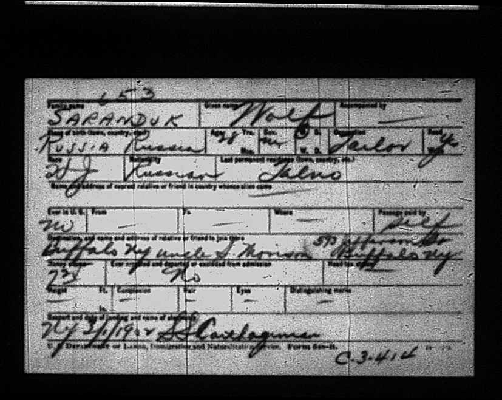
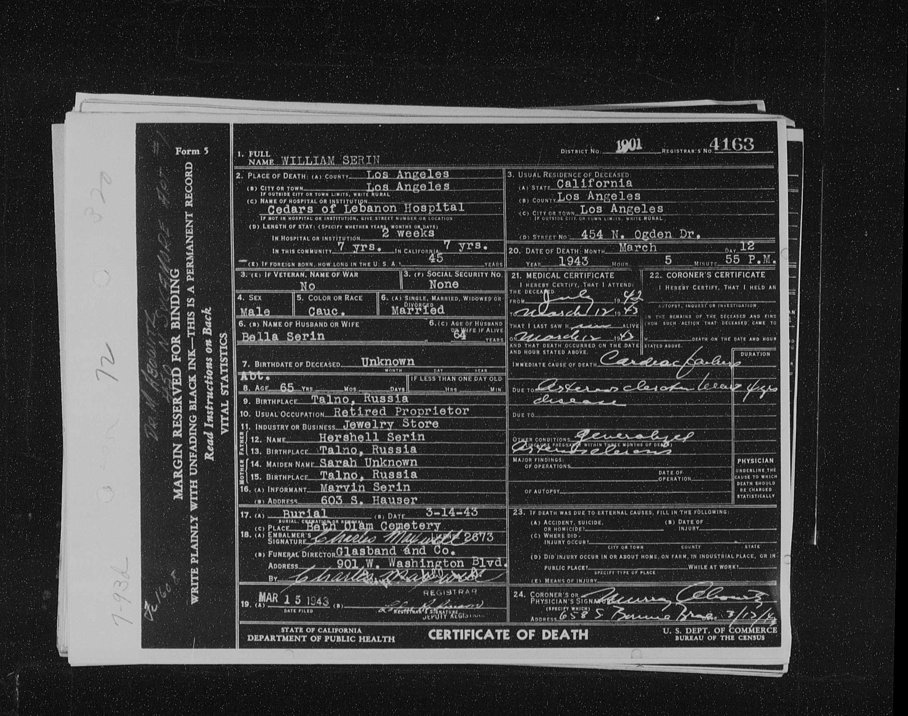
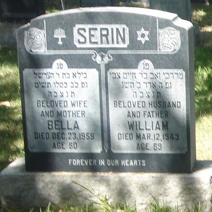

## A Notable Exception

Among the Saranduk family, there is a notable pattern: over time, the surname Saranduk converges into Shore. This shift appears consistently across close relatives who are traceable through civil records, immigration documents, and family memory.

Velvel Saranduk is the only known exception within that immediately traceable group.

While his siblings and cousins ultimately appear as Shore, Velvel does not. Instead, his line fractures differently — through a series of name adaptations that never resolve into the family’s eventual norm. If more distant relatives adopted other surnames, they are harder to trace; Velvel is unusual precisely because he is both close and divergent.

More distant relatives may well have adopted other surnames, but they are harder to trace. Velvel is unusual precisely because he is both genealogically close and demonstrably divergent.

## Names Without Convergence

Velvel was born in 1874 in Talne, to [Hyman and Sarah Shore](/post/hyman-and-sarah). In different records, he appears as Velvel, Wolf, and Volko — all vernacular equivalents — and in Hebrew as Mordechai Zev. Unlike Saranduk, which has no apparent semantic meaning, these given names align cleanly: each renders “wolf” in a different linguistic register.

In Ukrainian revision lists from 1897, he appears as Motez Volko Saranduk, son of Khaym Ghersh Saranduk, head of household, a tailor by trade. Later migration records show Wolf Saranduk leaving the region in 1902, bound for Buffalo, New York. In American records, he does not become Shore. Instead, he becomes Serin (sometimes Serrin) — a surname that is neither a translation nor a direct truncation, but an accommodation.

This divergence persists across his descendants.

He was married to **Bella (Bayla) Sarles** in Talne. He died in California on March 12th, 1943 at age 69.

Found on the Ukraine Revision Lists, Group 2, yr 1897 under surname "Saranduk" in the town of Talne:

| Given Name    | Father       | Relationship to Head of Househoud | Sex | Age |
| ------------- | ------------ | --------------------------------- | --- | --- |
| Motez Volko   | Khaym Ghersh | Head of Household                 | M   | 26  |
| Beyla         | Gershko      | Wife of Motez Volko               | F   | 23  |
| Peysya Brucha | Motez Volko  | Daughter                          | F   | 1   |

[Original Ukrainian Census Document](https://data.jewishgen.org/imagedata/ukraine/Uman_district/384-12-301/104.jpg)

Here is a photograph of the Migration record from 1902 where Wolf Saranduk claims he is moving to Buffalo, NY to join an uncle (S. Morison?)

It lists his profession as a tailor. That is the profession listed for all Saranduk men (as far as I know).

On his death certificate it says he had a Jewelry Shop in California. I don’t know much about how he wound up so far away from the rest of the Saranduk family, or why he changed his name to Serin (sometimes Serrin) instead of Shore (although it does seem somewhat closer to the original).

### Children

- **Pessia Brucha Saranduk**, born 1896/7 in Tal'ne, is found in the Ukrainian Revision Lists. A Pessie Saranduk found on the ship logs at Ellis Island for the U.S.S Gerty. She eventually married _Maurice Berren_ and died in Rhode Island Hospital in December 28th, 1925 (at the age of 29) of Tuberculosis. The name on her tombstone is Bertha Serin Berren.
- **Rosa Saranduk**, born 1900 in Tal'ne, is also found on the U.S.S Gerty ship logs, as Rosa II. She married Abraham Levin.
- **Moische (Marvin) Saranduk**, born in 1904 in Tal'ne, is also found on the U.S.S Gerty ship logs Moses. Later married **Catherine Rabinowitz**. According to a 1950 Los Angeles survey, Marvin Serin was employed as an auctioneer. Catherine as a bookkeeper.
- **Jacob Serin**, born in 1907 in America (Buffalo, NY).
- **Edgar Serin**, born 1912 in America. Wife's name was Dorothy.
- **Irving Serin**, born 1916 in America. Married _Betty May Gilmor_.
